# LeaveFlow

LeaveFlow is an Employee Leave Management System that enables employees to request leave, managers to review and approve requests, and administrators to manage organizational leave policies. It is built using the BMAD (Business Modeling and Agile Development) methodology to demonstrate an AI-first software engineering workflow.

## Features

- Employee authentication with JWT
- Role-based access control
- Leave request and approval workflow
- Leave balance management
- Holiday and leave policy management
- Audit logging
- Dockerized development environment

## Screenshots

A tour of the running application. The interface is a single-scroll console — a role-aware
sidebar on the left, one surface at a time on the right — and ships with both light and dark
themes.

### Sign in

Token-based authentication (JWT). The session is a Bearer token held in the browser and
attached to every request; the server signs you out the moment it rejects one.

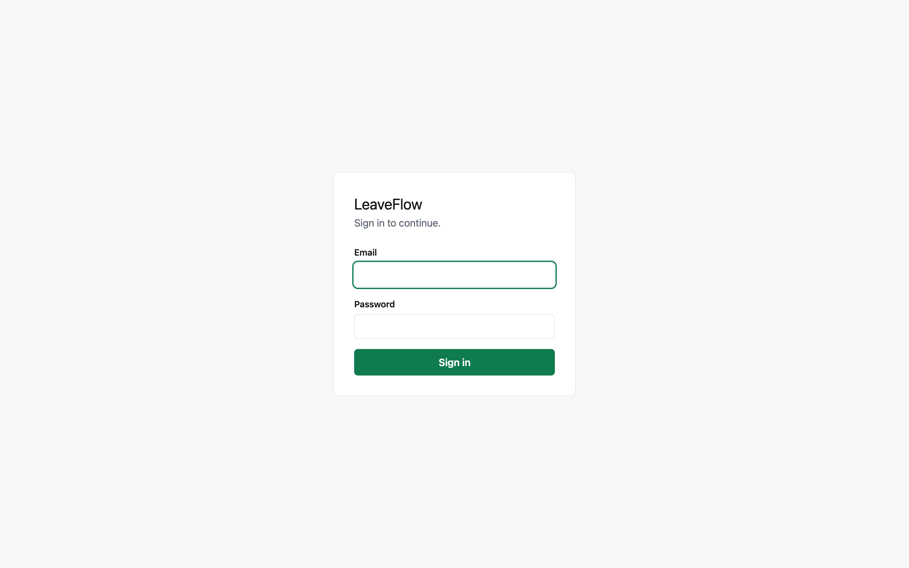

### Dashboard

Balances for the current leave year and requests still awaiting a decision. The view is
scoped to your role: everyone sees their own balances, a Manager additionally sees their
team's, and an Admin the whole organization.

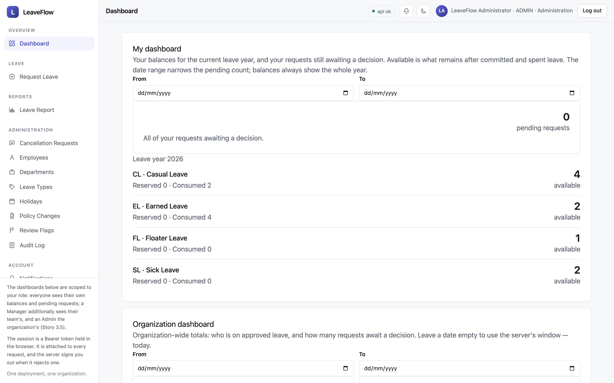

### Request leave

Employees file a request against a leave type, with balances and holidays taken into account.

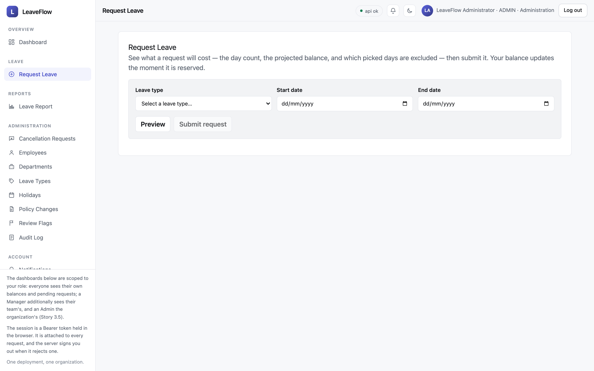

### Administration

Admins configure the whole organization — people, structure, and policy — as configuration
rather than code.

| Employees | Departments |
| --- | --- |
| [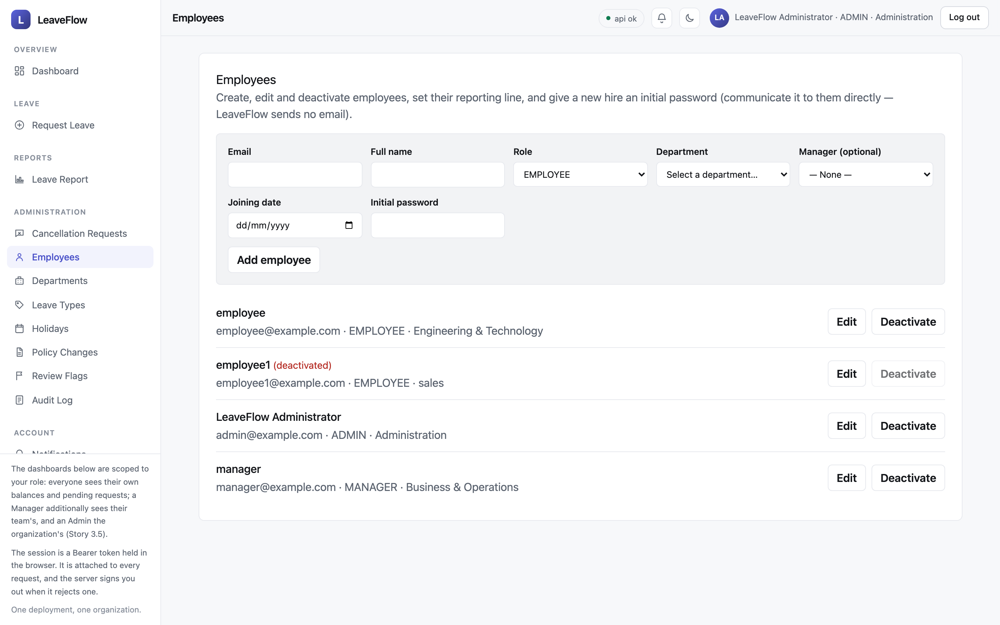](docs/screenshots/employees.png) | [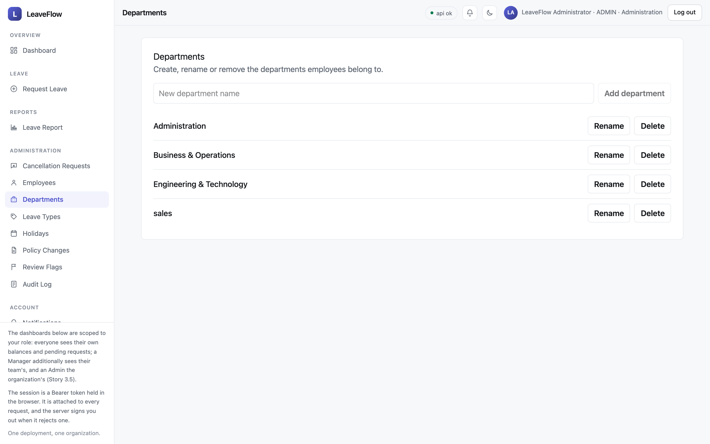](docs/screenshots/departments.png) |

| Leave types | Holidays |
| --- | --- |
| [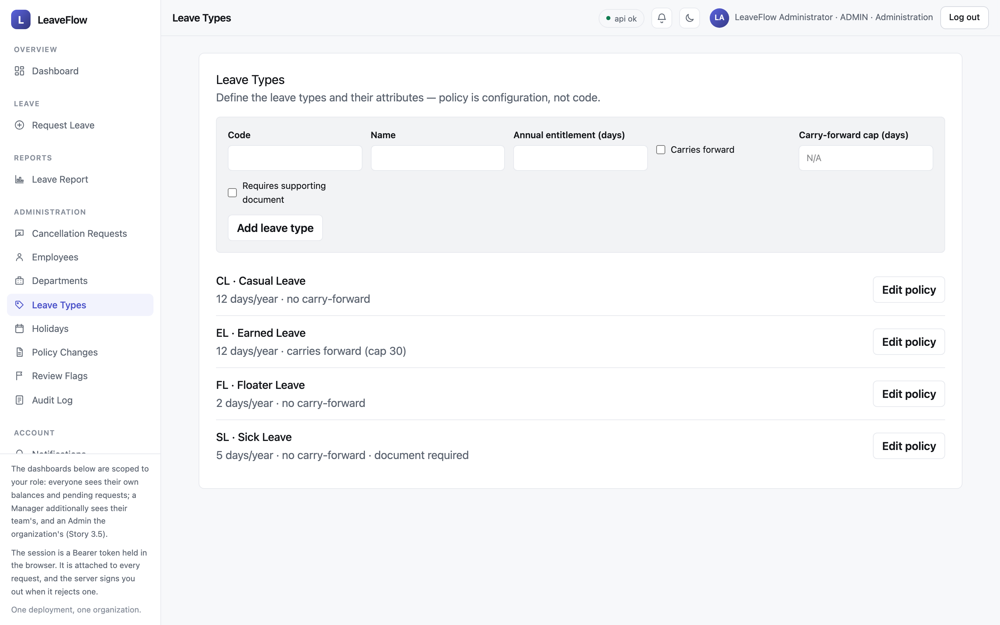](docs/screenshots/leave-types.png) | [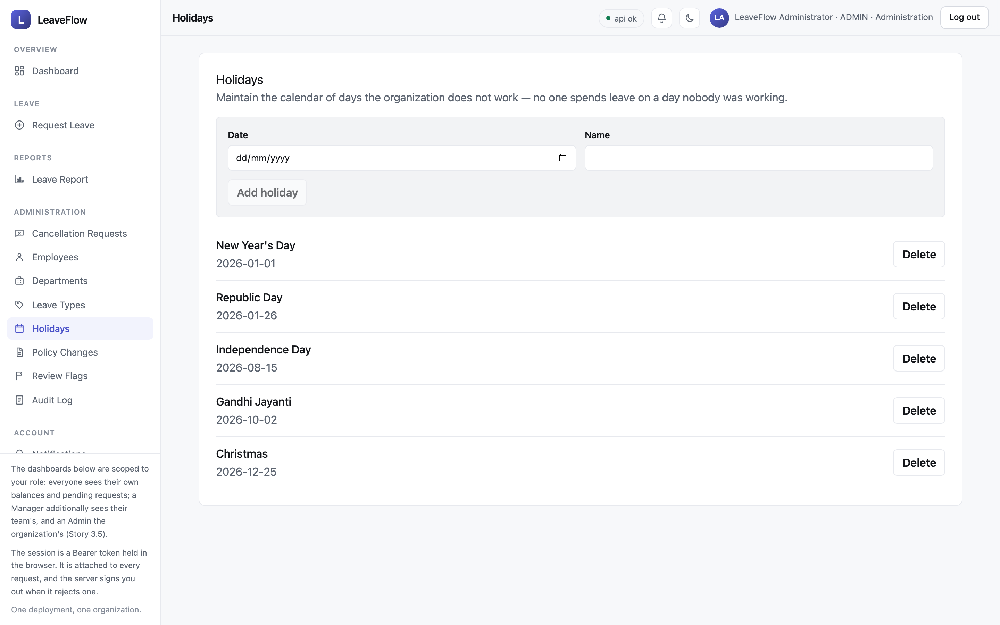](docs/screenshots/holidays.png) |

### Reporting & audit

Organization-wide leave reporting for managers and admins, and an immutable audit log of
every consequential action.

| Leave report | Audit log |
| --- | --- |
| [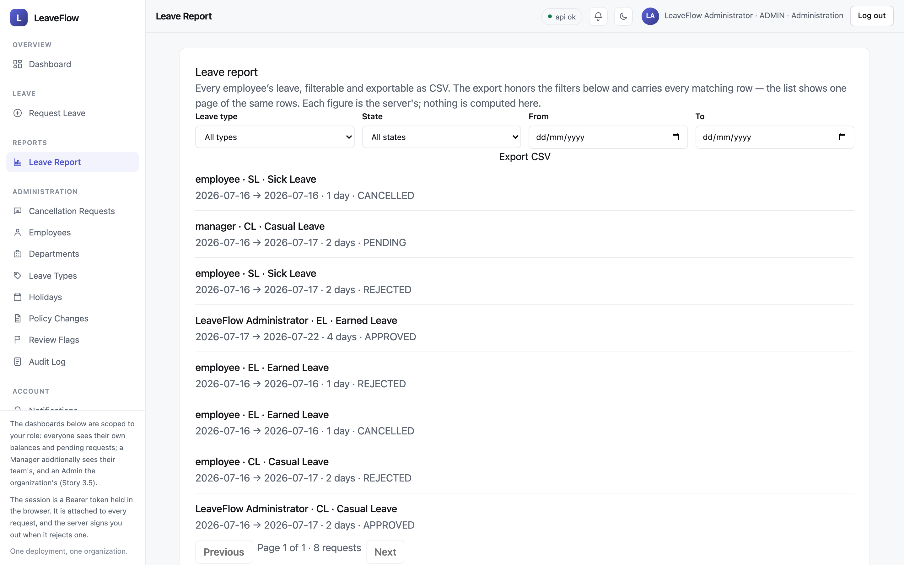](docs/screenshots/leave-report.png) | [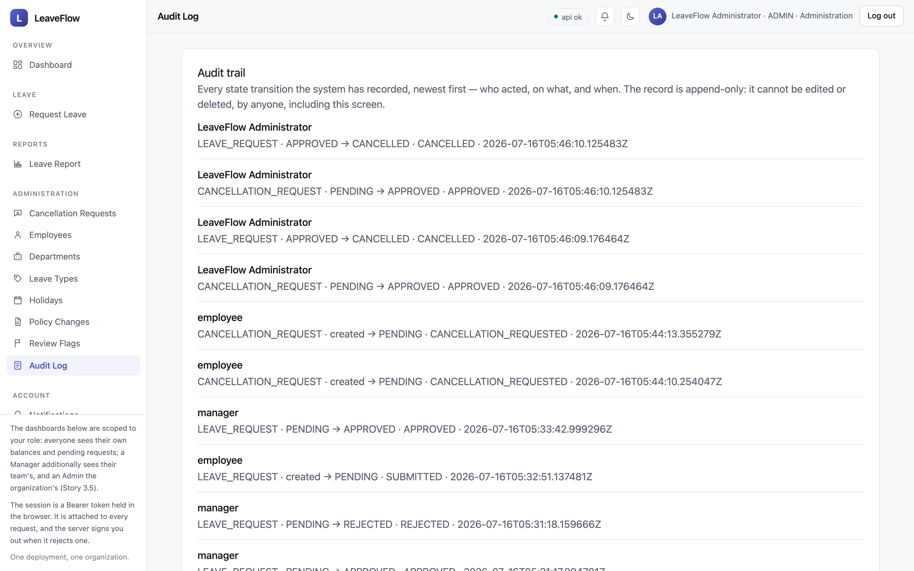](docs/screenshots/audit-log.png) |

### Account

Per-user notifications and profile.

| Notifications | Profile |
| --- | --- |
| [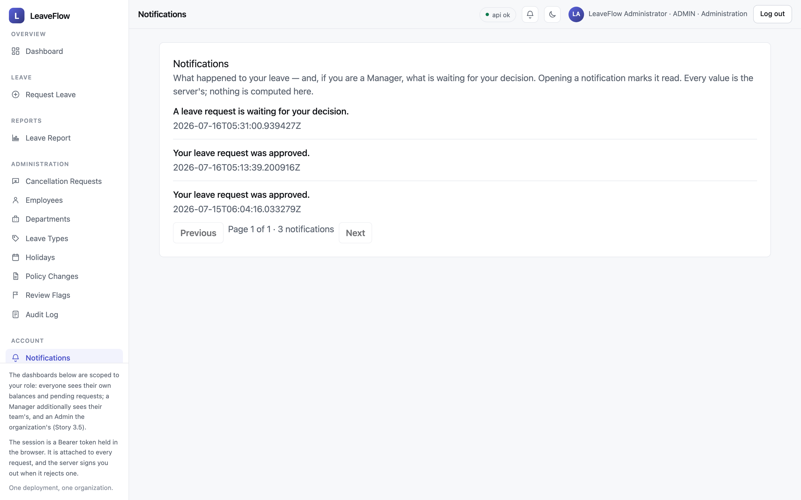](docs/screenshots/notifications.png) | [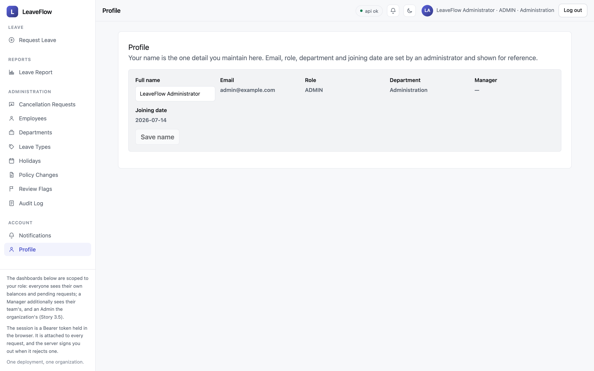](docs/screenshots/profile.png) |

## Tech Stack

- FastAPI
- React + Vite
- PostgreSQL
- Alembic
- Docker Compose
- TanStack Query
- Python 3.13
- TypeScript 6.0.3

---

Leave management for one organization per deployment.

One deployment is one organization. There is no tenant column on any table, and there
never will be — a second organization is a second deployment with its own database.

## Setup

Reproducible from a clean machine (`NFR-21`). Three commands, in this order.

### Prerequisites

- **Docker**, with `docker compose`. That is the whole list: commands two and three
  run inside the `api` container, so the setup needs no host Python. (Running the
  test suite does — see *Tests*.)

> **Using Homebrew's `docker` CLI with colima rather than Docker Desktop?**
> Homebrew installs the Compose plugin where the `docker` CLI does not look for it, so
> `docker compose` reports `unknown command`. Register it once:
>
> ```jsonc
> // ~/.docker/config.json
> { "cliPluginsExtraDirs": ["/opt/homebrew/lib/docker/cli-plugins"] }
> ```
>
> Then `colima start`. Docker Desktop needs none of this.

### Configuration

Copy the example environment and replace every `CHANGE_ME`:

```bash
cp .env.example .env
python3 -c "import secrets; print(secrets.token_urlsafe(32))"   # for JWT_SECRET_KEY
```

`.env` is gitignored and must never be committed. `.env.example` is committed and
carries a placeholder for every value the setup below needs — if a step ever asks for a
value that is not in `.env.example`, that is a bug in `.env.example`.

### The three commands

```bash
# 1. Bring up proxy, web, api and postgres. Waits for postgres to become healthy.
docker compose up
```

```bash
# 2. Create the schema. In a second terminal:
docker compose exec api alembic upgrade head
```

```bash
# 3. Seed. Idempotent — safe to re-run.
docker compose exec api python -m seed
```

Commands two and three run inside the `api` container, which already carries the
pinned toolchain — a clean machine needs Docker and nothing else.

Then:

```bash
curl -k https://localhost:8443/api/v1/health     # -> {"status":"ok"}
open https://localhost:8443                      # the React shell
```

`-k` because the proxy mints a self-signed certificate on first start. A deployed
environment mounts a real one over the `proxy_certs` volume.

**The migration is deliberately not run by `docker compose up`.** A one-shot `migrate`
service would make command two a no-op, and the setup documented here would stop
matching the setup that actually runs.

### Ports

| Port | Service | Why |
| --- | --- | --- |
| `8443` | `proxy` (HTTPS) | The only way in. TLS terminates here. Not `443`, because binding below 1024 needs privilege the local runtime may not have; a deployed environment sets `PROXY_HTTPS_PORT=443`. |
| `5433` | `postgres` | Published so host-run tooling (the integration tests) can reach the database. Not `5432`, because a developer machine very often already runs a PostgreSQL there — and host-run tooling would talk to whichever database answered. |

`api` and `web` are not published. They are reachable only through `proxy`, which is
what makes "the proxy sits in front of them" a fact about the topology rather than a
convention.

## Tests

`pytest` is the build. There is no CI pipeline, so the checks that must "fail the build"
fail `pytest` instead.

Running the backend suite on the host needs **Python 3.13** (not 3.14 — the stack is
pinned to 3.13 for library compatibility, and a later story must not upgrade it):

```bash
# One-time: create the venv. From the repository root:
cd backend
python3.13 -m venv .venv && .venv/bin/pip install -e ".[dev]"
```

```bash
# Backend. Integration tests need the stack up (`docker compose up -d`);
# without it they skip with a reason. From backend/:
.venv/bin/python -m pytest
```

```bash
# Frontend. From frontend/:
npm run build && npm run lint
```

- `tests/test_architecture.py` runs `import-linter` and **fails the suite** on any
  violation of the layering. Deleting it does not merely remove a test; it silently
  unenforces the architecture for every remaining story.
- `tests/domain/` runs with no database fixture, and must stay that way.
- `tests/integration/` needs real PostgreSQL, and **skips with a reason** if it is absent.

## Architecture

Four packages, one-way imports (`AD-1`):

```
api  ->  services  ->  { repositories, domain }
                         repositories -> domain
```

- `domain/` is pure: no ORM, no web framework, no I/O. Any function that computes a
  leave quantity lives here, which is what makes "exactly one implementation of the day
  count" a structural fact rather than something a reviewer must police.
- `api/` never imports `repositories/` or `domain/`.
- `repositories/` never imports `services/`.

These are enforced by seven `import-linter` contracts in `backend/pyproject.toml`. Note
that a `layers` contract alone is **not** sufficient — it permits skip-level imports, so
`api → domain` would pass. The `forbidden` contracts are what close that gap.

No import-graph tool can verify "performs no I/O". Purity is enforced *by proxy*, by
forbidding `domain/` from importing the libraries that perform it.

Data enters through `python -m seed`, never through a migration (`AD-11`) — so that a
fourth Leave Type can be added with no code change and no schema migration.
