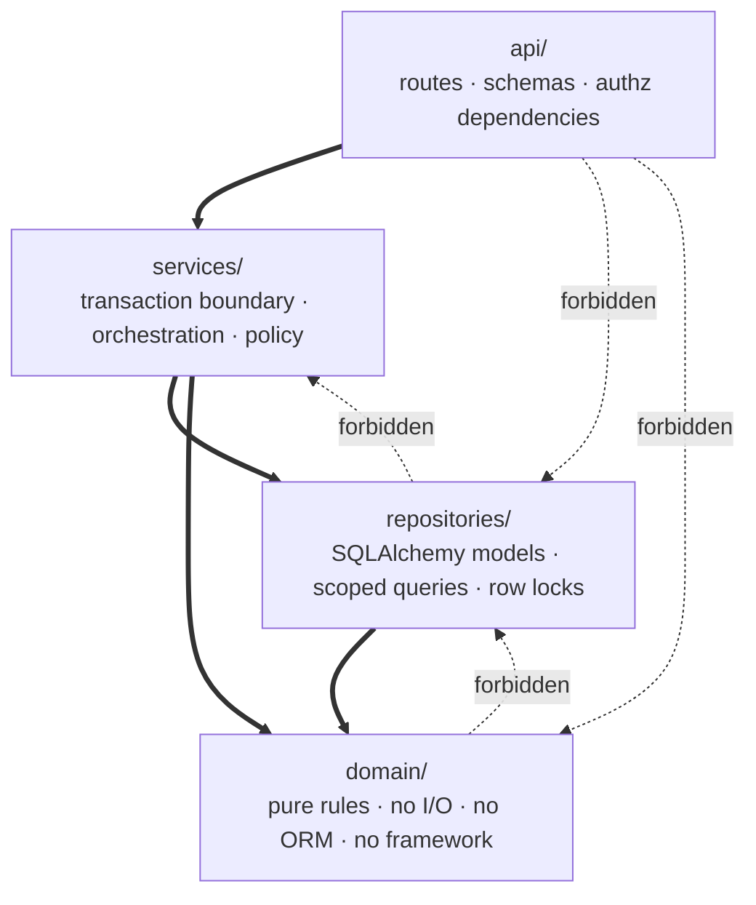
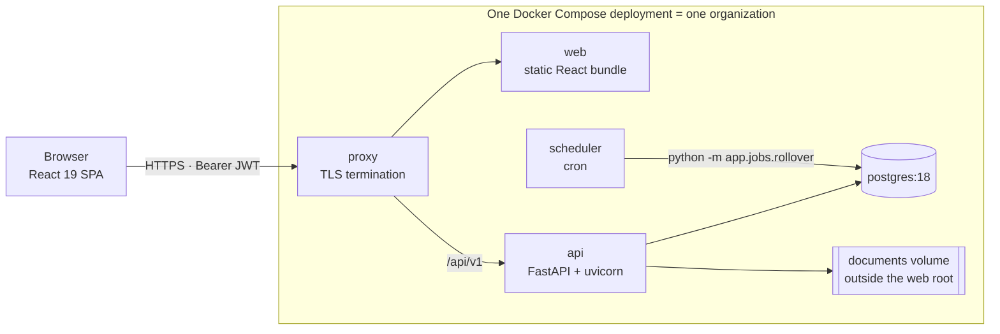
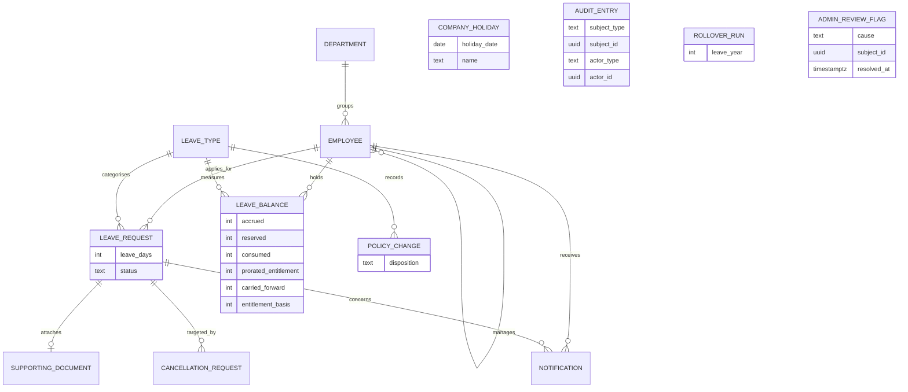
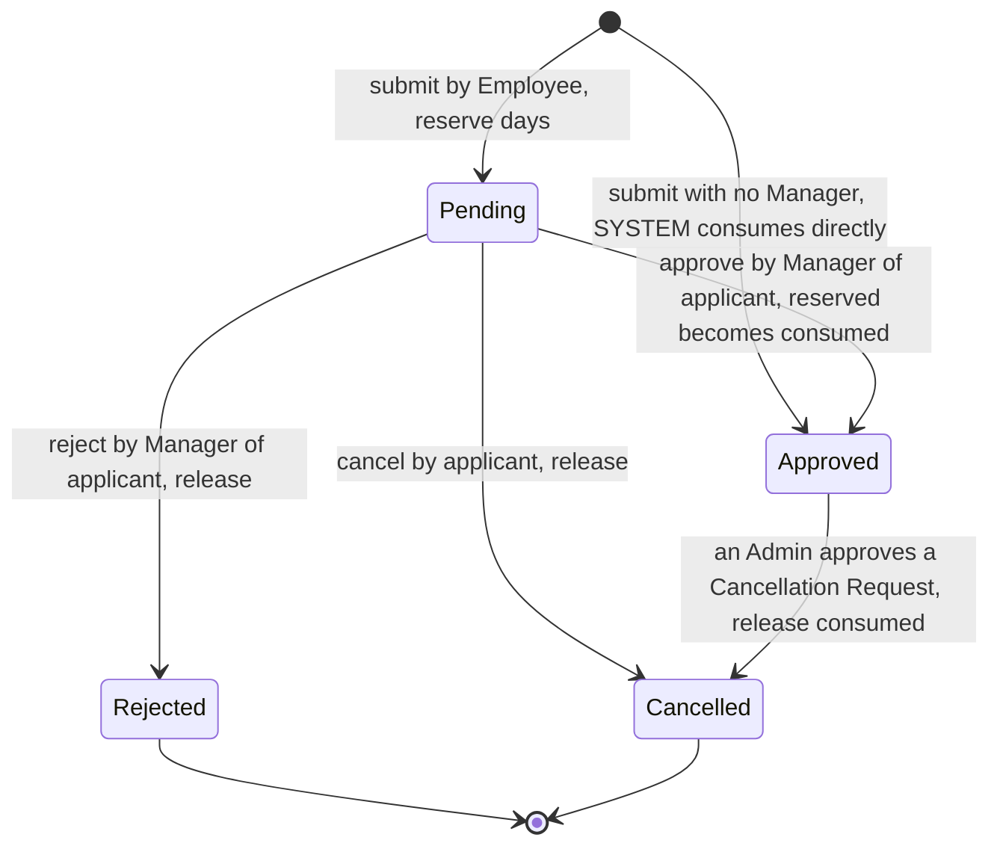
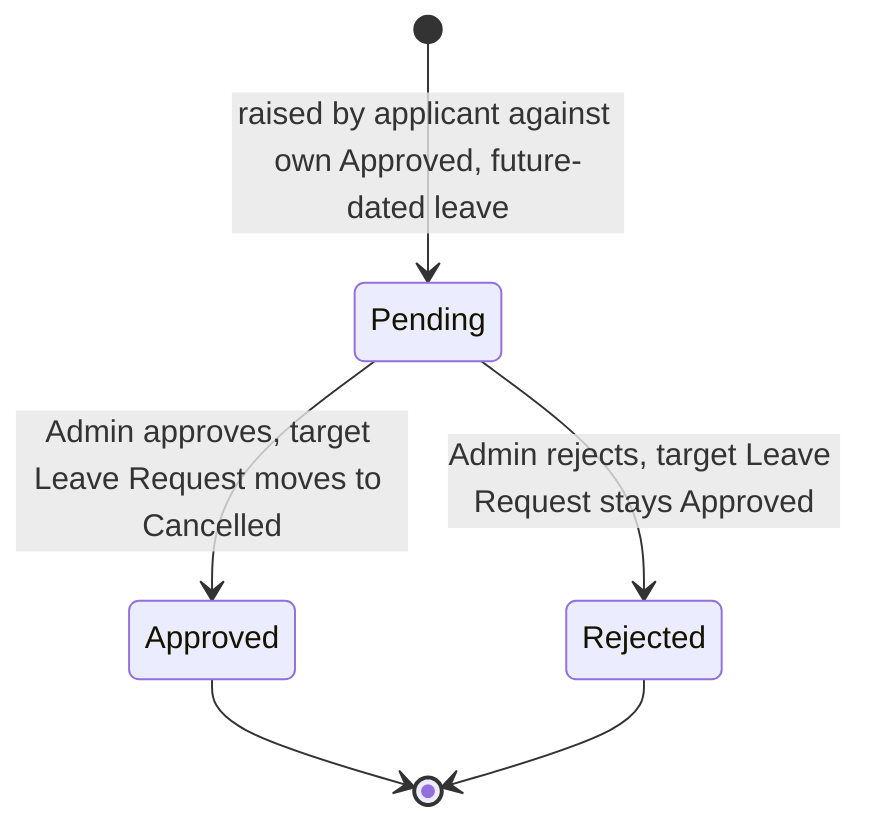

# Architecture Spine — LeaveFlow

## Design Paradigm

**Layered, around a functional core.** Four packages, one-way imports. `domain/` is a pure functional core — the leave-day count, proration, carry-forward, and the balance algebra — holding no I/O, no ORM, and no framework. `services/` is the imperative shell: it opens the transaction, loads rows, calls the core, writes the result. `repositories/` owns SQL and locking. `api/` owns HTTP and authorization.



## Invariants & Rules

### AD-1 — Dependency direction is one-way, and the core is pure

- **Binds:** all backend modules
- **Prevents:** business rules leaking into routes or repositories; a rule implemented where it cannot be unit-tested; a second implementation of a domain rule
- **Rule:** Imports flow `api → services → {repositories, domain}` and `repositories → domain`. `domain/` imports no ORM, no web framework, and performs no I/O. `api/` never imports `repositories/` or `domain/`. `repositories/` never imports `services/`. Any function that computes a leave quantity lives in `domain/`.

### AD-2 — The server is the sole authority on a Leave Day count

- **Binds:** FR-08, FR-10, DR-1, DR-2, NFR-08, UJ-1
- **Prevents:** the React client reimplementing weekend-and-holiday logic for its preview, and drifting the moment the holiday calendar changes
- **Rule:** One function, `domain.calendar.count_leave_days`, is the only code in the system that knows what a weekend or a Company Holiday is. Every path that produces a day count calls it, and its result is stored on the request at admission (AD-18). The client obtains every day count from the preview endpoint, which returns the count, each excluded date with its reason and the holiday's name, and the projected Available balance. No frontend module references a weekday or a holiday.

### AD-3 — Balance mutation protocol: one transaction, one lock order, one isolation level

- **Binds:** FR-07, FR-08, FR-09, FR-10, DR-4, DR-5, NFR-07, SM-1
- **Prevents:** lost updates between concurrent submissions; a time-of-check-to-time-of-use gap between reading Available and writing against it; deadlock between submission, decision, recalculation, and the rollover job
- **Rule:** Transactions run at READ COMMITTED, PostgreSQL's default, named here so no epic assumes otherwise. Exactly one transaction per command, opened in `services/` — never in a route, never in a repository. A command that writes any `leave_balance` quantity first acquires that row with `SELECT ... FOR UPDATE`, and **the Available value that decides admission or refusal is computed from the row read under that lock, in that transaction**; a value returned earlier by the preview endpoint is never load-bearing. A command that derives from one Leave Year and writes another locks both rows. Where several balance rows are locked they are locked in ascending `(employee_id, leave_type_id, leave_year)`. A command may read request rows unlocked to discover its working set, but must then lock its balance rows, and only afterwards re-read each affected request `FOR UPDATE` in ascending `id` order and re-validate its status before writing. Balance rows are always locked before request rows.

### AD-4 — A state transition is a guarded conditional update

- **Binds:** FR-09, DR-5, DR-16
- **Prevents:** a silent overwrite when a Manager approves a request the applicant has just cancelled
- **Rule:** Every transition of a Leave Request or Cancellation Request is a single `UPDATE ... SET status = :to WHERE id = :id AND status = :from`. Zero affected rows means the transition is refused and the transaction rolls back. This *is* FR-09's first-committed-wins. No transition is performed by reading a status and then writing one.

### AD-5 — The schema is the backstop; the service is the gate

- **Binds:** FR-07, FR-08, DR-3, DR-5, NFR-17, SM-1
- **Prevents:** a service-layer bug producing a balance every downstream reader then believes; and an overspend surfacing as a database error instead of the refusal FR-08 requires
- **Rule:** `leave_balance` carries `CHECK (accrued - consumed - reserved >= 0)`, `CHECK (reserved >= 0 AND consumed >= 0)`, `CHECK (accrued = prorated_entitlement + carried_forward)`, and `UNIQUE (employee_id, leave_type_id, leave_year)`. `available` is never a column. These constraints are a **backstop, never a gate**: before every write, AD-17's owning module verifies the outcome under the lock and raises a typed domain error carrying its numbers — `INSUFFICIENT_BALANCE` names days requested and days available. A CHECK violation reaching a client is a defect and a 500, never a refusal. Because the equality CHECK is not deferrable, `accrued`, `prorated_entitlement` and `carried_forward` always move in a single statement.

### AD-6 — Carry-forward is derived, never accumulated

- **Binds:** FR-07, DR-7, DR-7a, the rollover job
- **Prevents:** days both Consumed in year Y *and* carried into Y+1; and days silently lapsing when a year-Y Pending request is rejected after the boundary
- **Rule:** `carried_forward(Y+1) = min(leave_type.carry_forward_cap, available(Y))`, computed from year Y's live balance and written by assignment, never by increment. It is recomputed on **every** event that can change its inputs: a year-Y request transition, a year-Y recalculation under AD-19, and a change to that Leave Type's `carry_forward_cap` or `annual_entitlement` — the last of which is not a balance change and must therefore be wired as an explicit trigger. Recomputation propagates forward through every materialized later year. Under request transitions alone, approval transfers Reserved to Consumed and leaves Available unchanged, so `available(Y)` only rises and carry-forward only tops up. Under AD-19's recalculation paths it may fall, and AD-19 governs what happens then. The rollover assigns derived values and is therefore idempotent by construction.

### AD-7 — The rollover runs outside the web process

- **Binds:** FR-07, FR-16, NFR-15, SM-5
- **Prevents:** N uvicorn workers each registering a scheduler and firing N concurrent rollovers contending for the same row locks; a batch job dying with a web restart
- **Rule:** The rollover is a CLI entrypoint, `python -m app.jobs.rollover --year YYYY`, invoked by an external scheduler. No scheduler is registered inside the FastAPI application. The job is directly callable from a test with no running server and no clock manipulation.

### AD-8 — `audit_entry` records transitions, and only transitions

- **Binds:** FR-16, DR-14, DR-16, SM-4
- **Prevents:** SM-4's one-to-one count being false the day it is written; an audit row surviving a rolled-back transition; two epics disagreeing on whether the rollover writes audit rows
- **Rule:** `audit_entry` holds exactly one row per state transition of a Leave Request or a Cancellation Request, and nothing else. Its columns are `subject_type`, `subject_id`, `from_state`, `to_state`, `actor_type`, `actor_id`, `reason`, `occurred_at`. `actor_id` is a **nullable foreign key** to `employee`, NULL if and only if `actor_type` is SYSTEM — nullable rather than absent, so referential integrity survives. The audit row is inserted inside the same transaction as the transition it records, so a rolled-back transition leaves no entry. The rollover writes to `rollover_run`, a separate append-only table.

### AD-9 — Append-only is a grant, not a habit

- **Binds:** FR-16, NFR-09, SM-4
- **Prevents:** a future repository method, or a careless service, updating or deleting an audit row
- **Rule:** The application's database role is granted `INSERT` and `SELECT` on `audit_entry` and `rollover_run`, and is granted neither `UPDATE` nor `DELETE`. Alembic migrations run under the owner role. No repository exposes an update or delete method for either table. NFR-09 therefore holds against code not yet written.

### AD-10 — Authorization is a query predicate, and absence is 404

- **Binds:** FR-03, FR-11, FR-12, FR-13, FR-15, FR-16, FR-17, FR-18, FR-19, FR-20, DR-12, DR-13, NFR-03, NFR-04, SM-3
- **Prevents:** a Manager reaching a non-report by guessing an identifier; a 403 disclosing that a resource exists; post-filter scoping that leaks the first time a new endpoint forgets it
- **Rule:** No repository exposes an unscoped getter. Every read that could return another Employee's data takes the actor and applies the scope as a predicate *in the SQL*, never as a filter over retrieved rows. A resource outside the actor's scope returns **404**, byte-identical to a nonexistent resource; 403 is reserved for a resource the actor may see but not act upon. A Manager's scope is `employee.manager_id = :actor_id`, evaluated at request time, so a reassignment takes effect on the next decision.

### AD-11 — Leave Type is data; request status is code

- **Binds:** FR-06, DR-11, NFR-14, SM-5
- **Prevents:** a fourth Leave Type requiring a schema migration; a status value set the code cannot exhaustively handle
- **Rule:** `leave_type` is a table row. It is never a Python `Enum` and never a PostgreSQL `ENUM` type, and no branch anywhere tests a Leave Type by name or code. Its three seed rows are inserted by a seed command, never by a migration. Conversely `leave_request.status` and `cancellation_request.status` are `TEXT` constrained by `CHECK` — not PostgreSQL `ENUM`s, whose value sets cannot be extended without a migration.

### AD-12 — A calendar date and an instant are different types  `[ADOPTED]`

- **Binds:** FR-08, FR-10, DR-1, DR-2a, DR-6
- **Prevents:** off-by-one-day errors at midnight boundaries
- **Rule:** Leave dates, Company Holiday dates and the Leave Year boundary are PostgreSQL `DATE` and Python `datetime.date`. Audit and notification instants are `TIMESTAMPTZ`. No leave date is ever stored, compared, or transported as a timestamp. The API transports leave dates as `YYYY-MM-DD`.

### AD-13 — Cancellation Request is an entity, not a status  `[ADOPTED]`

- **Binds:** FR-09, DR-4, DR-14, BR-05
- **Prevents:** modelling cancellation as a fifth Leave Request status, which makes "Approved while its cancellation is pending" unrepresentable
- **Rule:** `cancellation_request` is its own table with its own Pending, Approved and Rejected lifecycle, decided by an Admin, targeting exactly one Approved Leave Request. The targeted Leave Request remains Approved throughout. Only an approved Cancellation Request moves it to Cancelled, releasing its Consumed days via AD-17's `release_consumed`. Both objects' transitions write to `audit_entry` under AD-8. A Cancellation Request against leave whose dates have passed is refused.

### AD-14 — The client renders authority; only the server enforces it

- **Binds:** FR-01, FR-02, FR-03, NFR-01, NFR-02, NFR-03, NFR-16
- **Prevents:** a hidden control being mistaken for an access control; a login endpoint disclosing which accounts exist; a CVE-bearing auth library reaching production
- **Rule:** The JWT travels as an `Authorization: Bearer` header and carries an `exp` claim with a lifetime measured in hours, not days; a token that is absent, expired, or whose signature does not verify is rejected (NFR-02). Every restricted operation is checked in an `api/` dependency against the database, independently of anything the client sent beyond the token's subject. NFR-16's role-appropriate rendering is a usability measure and is never the only thing preventing an action. Authentication failure never discloses whether an account exists: an unknown identity and a wrong password produce byte-identical bodies and equal status codes. Passwords are hashed with bcrypt or Argon2 via `pwdlib`; `passlib` is not used, being unmaintained since 2020 and broken against bcrypt 5. JWTs are signed and verified with `PyJWT`; `python-jose` is not used, on the strength of CVE-2024-33663.

### AD-15 — Supporting documents are opaque on disk

- **Binds:** FR-13, NFR-05
- **Prevents:** path traversal through a client-supplied filename; a document served to an unauthorized reader by a static file handler
- **Rule:** A document is written to a volume outside the web root under a server-generated UUID name. The client-supplied filename is persisted as a data column and is never used as a path component. Documents are served only by an authorized streaming endpoint that re-applies AD-10's scope; no static route maps to the volume. Type (PDF, JPG/JPEG, PNG) and size (at most 5 MB) are validated before any bytes are written.

### AD-16 — Notification read-state is a nullable instant, written in the command's transaction

- **Binds:** FR-11, FR-14
- **Prevents:** an unread count and a read flag drifting apart; a Notification existing for a transition that rolled back; two epics inventing different mark-read semantics
- **Rule:** A notification carries a recipient, a `kind` discriminator, the Leave Request it concerns, a nullable `read_at`, and `created_at`. The unread count is `COUNT(*) WHERE read_at IS NULL` and is never stored. The service that performs a transition is the service that writes its Notification, inside that transition's transaction, so one exists if and only if the transition committed; no other service writes notifications. Mark-read is an idempotent `PATCH` on the notification, permitted only to its addressee.

### AD-17 — One module owns every balance mutation

- **Binds:** FR-07, FR-08, FR-09, FR-10, DR-3, DR-4
- **Prevents:** two epics writing `reserved` and `consumed` with divergent semantics; a shared `consume` that decrements `reserved` crashing on the managerless auto-approval path, which consumes without ever having reserved
- **Rule:** Exactly one module mutates a `leave_balance` quantity, and it exposes exactly these operations: `reserve`, `consume_reserved`, `consume_direct`, `release_reserved`, `release_consumed`, `adjust_reserved`, `adjust_consumed`, `set_accrual`. `consume_direct` is FR-09's managerless auto-approval and never touches `reserved`. `release_consumed` is BR-05's approved-cancellation path. `set_accrual` writes `accrued`, `prorated_entitlement` and `carried_forward` in one statement (AD-5). No route, repository, job, or other service writes these columns.

### AD-18 — The Leave Day count is frozen on the request

- **Binds:** FR-08, FR-10, FR-15, FR-20, DR-1, DR-2
- **Prevents:** a history view or an export recomputing the day count against today's holiday calendar and disagreeing with the days actually reserved or consumed; past-dated leave being retroactively re-counted
- **Rule:** `leave_request.leave_days` is computed once by AD-2's function at admission and stored. Every read path — history, dashboard, calendar, export — reads the stored value and never recomputes it. Only AD-19's recalculation may change it, and only for a Pending request, or an Approved request whose dates lie wholly in the future. An Approved request whose dates have passed is never recalculated.

### AD-19 — Recalculation is forward-checked and refusable

- **Binds:** FR-06, FR-07, FR-10, DR-5, DR-7
- **Prevents:** an Admin's holiday edit or policy change driving an already-spent later year negative, and surfacing as a database error rather than as the refusal FR-10 specifies
- **Rule:** Adding or deleting a Company Holiday, and changing a Leave Type's `annual_entitlement` or `carry_forward_cap` under the disposition RECALCULATE, both re-derive the affected `leave_days`, the affected balance quantities, and — through AD-6 — `carried_forward` in every materialized later year. Within the same transaction, and independently for each affected Employee and Leave Type, the operation verifies that no year's Available becomes negative. Where it would, that Employee and Leave Type are left **entirely unchanged**, a row is written under AD-20, and the remainder of the operation proceeds. No recalculation relies on AD-5's CHECK constraints to discover this.

### AD-20 — What the system refuses, and what it cannot infer, is persisted

- **Binds:** FR-06, FR-10
- **Prevents:** two epics inventing two exception stores; a refusal existing only in a log line that no Admin surface reads; a policy change applied without the choice FR-06 requires being recorded
- **Rule:** `admin_review_flag` records every refusal AD-19 produces, with its cause and its subject — the Employee and Leave Type left unchanged. It is the only such store, it is **read-only to the Admin** (FR-10 grants the read and no requirement grants a resolve), and no other role reads it. `policy_change` records every Leave Type attribute change together with the Admin's explicit disposition — RECALCULATE or PRESERVE — which FR-06 requires be chosen and recorded before the change is applied. It carries no actor, by decision: PRD §1 promises attribution only for Leave Request state changes. Neither table is `audit_entry`, which AD-8 reserves for transitions.

### AD-21 — One canonical vocabulary, declared once

- **Binds:** FR-09, FR-14, FR-16, DR-16, SM-4
- **Prevents:** AD-4's guarded `UPDATE` matching zero rows because one epic wrote `Pending` and another `PENDING`, silently refusing every transition; SM-4's audit query under-counting on a mis-cased `subject_type`
- **Rule:** Every enumerated string — Leave Request and Cancellation Request `status`, `subject_type`, `actor_type`, notification `kind`, and error `code` — is `UPPER_SNAKE_CASE`, is declared exactly once as a constant in `domain/`, and appears as a literal nowhere else. Leave Request statuses are PENDING, APPROVED, REJECTED, CANCELLED. Actor types are EMPLOYEE and SYSTEM. The API transports these values verbatim, uppercase.

### AD-22 — The deactivation guards protect the auto-approval path

- **Binds:** FR-04, FR-09
- **Prevents:** an Admin deactivating a Manager, orphaning their Direct Reports, and thereby causing FR-09 to auto-approve those reports' Pending requests with no human approver
- **Rule:** An Employee is never deleted, only deactivated, and deactivation preserves their Leave Requests, Leave Balances and Audit Entries. Deactivation is refused while that Employee has any Pending Leave Request, and refused while any active Employee names them as Manager. A deactivated Employee cannot authenticate. FR-09's auto-approval is reachable only for an Employee whose `manager_id` is NULL — a state this rule prevents deactivation from ever creating.

## Consistency Conventions

| Concern | Convention |
| --- | --- |
| Naming — database | Tables and columns `snake_case`, table names singular (`employee`, `leave_request`, `audit_entry`). Primary keys named `id`. |
| Naming — Python | Modules `snake_case`; SQLAlchemy models `PascalCase`; domain functions `verb_noun` (`count_leave_days`, `prorate_entitlement`). Pydantic API schemas live in `api/` and never double as tables. |
| Naming — HTTP & React | Paths plural and kebab-case under `/api/v1` (`/api/v1/leave-requests`). React components `PascalCase`; hooks `useThing`. |
| Identifiers | UUID primary keys generated by PostgreSQL 18's native `uuidv7()` — time-ordered for index locality, and non-enumerable, which keeps AD-10's 404 honest. |
| Leave quantities | `INTEGER` everywhere. A Leave Day is a whole number (DR-10); no `NUMERIC`, no float, in schema, domain, or API. |
| Proration | `annual_entitlement × remaining_months / 12`, counting the joining month through December inclusive, rounded **down** to a whole Leave Day (DR-9). Never rounded to nearest. Applied once, at the Employee's first materialized Leave Year. |
| Dates and instants | Leave dates `DATE` / `YYYY-MM-DD`. Instants `TIMESTAMPTZ` / RFC 3339 UTC. Never interchanged (AD-12). |
| Error shape | A single envelope of machine code, human message, and structured details. NFR-17 refusals carry their numbers in the details — `INSUFFICIENT_BALANCE` names days requested and days available; `SPANS_TWO_LEAVE_YEARS` names the boundary. |
| Errors in code | `domain/` and `services/` raise typed domain exceptions and never import HTTP. One `api/` exception handler maps them to the envelope and to status codes. |
| State mutation | Only `services/` opens transactions. Only `repositories/` issues SQL. Only AD-17's module writes a balance quantity. |
| Pagination | Every list endpoint enforces a server-side maximum page size; a client asking for more receives the maximum, not the larger page (NFR-11). |
| Configuration | `pydantic-settings`, read from the environment. `.env` is never committed; `.env.example` is (NFR-20). |
| Seeding | EL, CL and FL are seeded as data with `requires_supporting_document` set to **false**. No seeded Leave Type demands a document. An Admin may enable it per Leave Type (FR-06); enabling it before FR-13 ships leaves the requirement configurable but unenforced. |
| Indexing | Indexed access paths exist for employee, manager, department, leave year, and request status (NFR-12). |
| Observability | Structured JSON logs to stdout; a `/health` endpoint the deployment probes. Metrics and error monitoring are deferred. |
| Testing | `tests/domain/` runs with no database (SM-2, NFR-15). `tests/integration/` runs against real PostgreSQL, and owns SM-1's concurrent double-submit test. |
| Traceability | Every module names in its docstring the FR or DR it implements (SM-6). |

## Stack

Every version below was verified against PyPI, the npm registry, and official release pages on 2026-07-10. The code owns these once it exists.

| Name | Version |
| --- | --- |
| Python | 3.13 |
| FastAPI | 0.139.0 |
| Pydantic | 2.13.4 |
| SQLAlchemy | 2.0.51 |
| Alembic | 1.18.5 |
| psycopg | 3.3.4 |
| PostgreSQL | 18 |
| PyJWT | 2.13.0 |
| pwdlib | 0.3.0 |
| bcrypt | 5.0.0 |
| pytest | 9.1.1 |
| React | 19.2.7 |
| Vite | 8.1.4 |
| TypeScript | 6.0.3 |
| TanStack Query | 5.101.2 |

Three pins are deliberately behind the newest release. SQLAlchemy holds at the 2.0 line because 2.1 is still beta. TypeScript holds at 6.0.3, the last 6.x, rather than 7.0.2 — the Go rewrite, which shipped two days before this spine was written. Python holds at 3.13 rather than 3.14 for library compatibility. A three-day implementation budget cannot absorb a toolchain surprise.

## Structural Seed

The skeleton is hand-rolled rather than taken from `fastapi/full-stack-fastapi-template`. The template is current and matches the stack, but it ships SQLModel, which fuses the Pydantic API schema to the SQLAlchemy table and so cannot satisfy AD-1; it also ships email password recovery, which PRD §6 excludes. Its `docker-compose` and Alembic wiring are used as reference.

### Deployment — one deployment is one organization



Two environments: local development and one deployed environment. No organization column exists anywhere in the schema; a second organization is a second deployment with its own database. Reproducible setup (NFR-21) is `docker compose up`, then `alembic upgrade head`, then the seed command.

### Core entities

Attributes are shown only where a column is itself an invariant. `audit_entry` binds to its subjects polymorphically, by `subject_type` and `subject_id`, so that relationship carries no foreign key (AD-8).



`leave_balance` stores DR-3's three quantities plus the provenance FR-06 needs: `entitlement_basis` records the Annual Entitlement the row was accrued under, so an Admin choosing RECALCULATE has something to recalculate from. Provenance columns are not balance quantities, so DR-3 is untouched.

### Leave Request lifecycle



### Cancellation Request lifecycle — its own object, not a status above



### Source tree

```text
leaveflow/
  backend/
    app/
      api/v1/         # routers, Pydantic request/response schemas, authz dependencies
      services/       # one transaction per command; orchestration; policy
      repositories/   # SQLAlchemy 2.0 models, scoped queries, FOR UPDATE
      domain/         # PURE: calendar, proration, carry_forward, balance, vocabulary
      jobs/           # rollover CLI entrypoint
      core/           # settings, security, error envelope
    alembic/          # schema only; never seeds a Leave Type
    seed/             # inserts EL, CL, FL as data
    tests/
      domain/         # no database fixture
      integration/    # real PostgreSQL; concurrency tests
  frontend/
    src/
      api/            # typed client, TanStack Query hooks
      features/       # per-role surfaces
      components/
  docker-compose.yml
  .env.example
```

## Capability → Architecture Map

| Capability | Lives in | Governed by |
| --- | --- | --- |
| FR-01 Authentication | `api/v1/auth`, `core/security` | AD-14 |
| FR-02 JWT authorization | `api/v1` dependencies, `core/security` | AD-14 |
| FR-03 Role-based access control | `api/v1` dependencies, `repositories/` | AD-1, AD-10 |
| FR-04 Employee management | `api/v1/employees`, `services/employee` | AD-10, AD-22 |
| FR-05 Department management | `api/v1/departments`, `services/department` | AD-10 |
| FR-06 Leave Type management | `api/v1/leave-types`, `services/policy` | AD-5, AD-11, AD-19, AD-20 |
| FR-07 Balance, proration, carry-forward, lapse | `domain/balance`, `domain/proration`, `domain/carry_forward`, `jobs/rollover` | AD-3, AD-5, AD-6, AD-7, AD-17 |
| FR-08 Leave Request workflow and day count | `domain/calendar`, `services/leave_request` | AD-2, AD-3, AD-4, AD-5, AD-17, AD-18 |
| FR-09 Approval, rejection, cancellation | `services/leave_request`, `services/cancellation` | AD-4, AD-10, AD-13, AD-17, AD-22 |
| FR-10 Holiday management and recalculation | `api/v1/holidays`, `services/holiday`, `domain/calendar` | AD-2, AD-3, AD-18, AD-19, AD-20 |
| FR-11 Dashboards | `api/v1/dashboard`, scoped repository aggregates | AD-10, AD-16 |
| FR-12 Search, filtering, pagination | `repositories/` | AD-10; pagination convention |
| FR-13 Supporting document upload | `api/v1/documents`, `services/document` | AD-10, AD-15 |
| FR-14 In-app notifications | `services/` (in-transaction), `api/v1/notifications` | AD-16, AD-21 |
| FR-15 Reports and CSV export | `api/v1/reports` | AD-10, AD-18 |
| FR-16 Audit logs | `repositories/audit`, `api/v1/audit` (Admin only) | AD-8, AD-9, AD-10, AD-21 |
| FR-17 Personal profile | `api/v1/me` | AD-10 |
| FR-18 Department Leave Calendar | `api/v1/calendar` | AD-10, AD-18 |
| FR-19 Team member list | `api/v1/team` | AD-10 |
| FR-20 Leave history | `api/v1/leave-requests`, scoped | AD-10, AD-18 |

## Upstream Amendments — Applied

This spine surfaced five places where the PRD was internally inconsistent or incomplete. **All five were amended into the PRD on 2026-07-10**, so the two no longer diverge. Recorded here because the reasoning is load-bearing and the ADs below were written against it.

- **DR-7 and DR-7a did not compose.** DR-7 carries unused Accrued days forward up to the cap; DR-7a keeps a Pending request's Reserved days alive across the boundary. Neither said whether Reserved days are "unused". Counting them double-counts a request later approved; not counting them silently lapses a request later rejected. DR-7 now defines "unused" as `Available`, recomputed live, matching AD-6; AD-19 governs the paths that can lower it. The most consequential of the five.
- **FR-07** claimed the Leave Year rollover's "Audit Entries record the actor `SYSTEM`", though the glossary defines an Audit Entry as one *Leave Request state transition* and SM-4 counts them one-to-one. The rollover transitions no Leave Request. FR-07 now records to a separate append-only rollover log, matching AD-8's `rollover_run`.
- **FR-10**'s refuse-and-flag rule reached neither FR-06's policy recalculation nor downstream Leave Years, and named no store. FR-10 and FR-06 now carry both, matching AD-19; the store is `admin_review_flag` under AD-20, **read-only to the Admin** — FR-10 grants the read, and no requirement grants a resolve.
- **FR-14** required an unread count that decrements on reading, but stated no mark-read mutation. FR-14 now carries it, matching AD-16.
- **PRD §1 (Vision)** promised that "every state change is attributable to an actor and a moment", while FR-16 and NFR-19 delivered attribution only for Leave Request state transitions. The PM narrowed the Vision rather than widening the requirements: it now reads "Every Leave Request state change is attributable to an actor and a moment." Policy and holiday edits remain deliberately unattributed — `policy_change` carries no actor, and no holiday-change entity exists. Raised by the Module 4 ERD as GAP-3.

Separately, **PRD §7.3** declined to choose whether any seeded Leave Type requires a Supporting Document. It is now resolved in FR-06 and §7.3: none does. The Seeding convention above records it.

## Open Questions

- **How long may a Leave Request remain Pending?** No source document bounds it, and **by project decision none is introduced**: no expiry, no rollover blocking, no new lifecycle behavior. AD-6's recomputation and AD-19's forward check are already correct for any number of open Leave Years, so the absence of a bound is a performance characteristic, not a correctness defect. Recorded as a known limitation: a Leave Request Pending across several Leave Year boundaries widens every subsequent recomputation. Any bound would be a policy no source rule authorizes. Routed to the PM.

## Deferred

- **Attribute-level schema and index tuning** beyond NFR-12's five named access paths. Module 4's ERD owns it; this spine fixes only the columns that are themselves invariants.
- **Per-endpoint request and response schemas.** The generated OpenAPI document is the runtime source of truth, which is why D-05 chose FastAPI. Only the base path, the error envelope, the vocabulary (AD-21) and the pagination bound are fixed here.
- **React state shape below the page level, styling, and component library.** No two epics can diverge structurally once AD-2, AD-14 and AD-21 hold.
- **Metrics and error monitoring.** Structured logs and a health endpoint are conventions above; anything richer is out of budget and is not required by Module 1's NFR set.
- **Concurrency cost of a holiday recalculation.** AD-19 locks every affected balance row, so a calendar edit stalls concurrent submissions organization-wide for its duration. Acceptable at this data scale (NFR-10). Revisit if it is not.
- **CI/CD, backup and disaster recovery, rate limiting, high availability, horizontal scalability, internationalization, and WCAG conformance.** All are explicitly not required by Module 1's NFR set. No seam is reserved for them.
- **Leave encashment.** A PRD non-goal, and the one with a recorded compliance exposure: AD-6's `min(cap, available)` forfeits Earned Leave above the cap, which Indian statute generally requires be encashed. Accepted for a trainee project; a production deployment must address it. No seam is reserved.
- **Email delivery, PDF export, and charted analytics.** PRD non-goals. Adding email later means an outbound adapter behind `services/`, not rearranging the spine.
- **Multi-tenancy.** No organization column exists anywhere. A second organization is a second deployment with its own database. Deliberate, and expensive to reverse.
