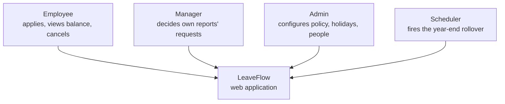
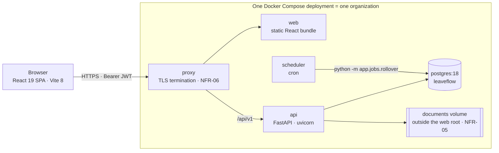
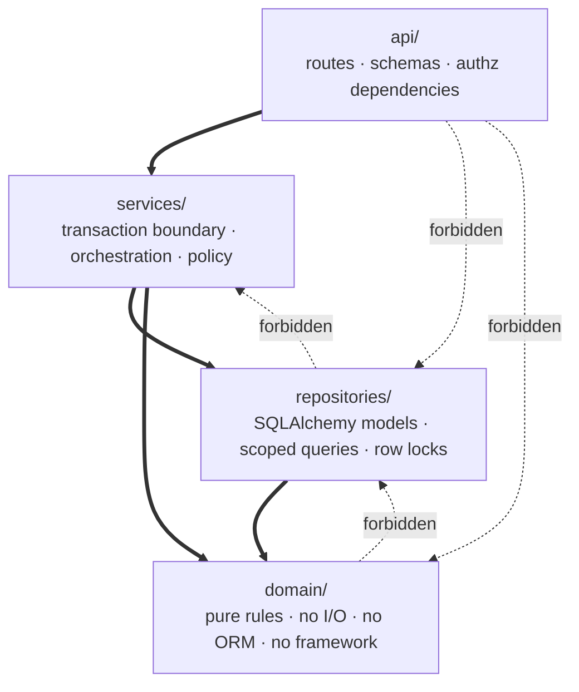
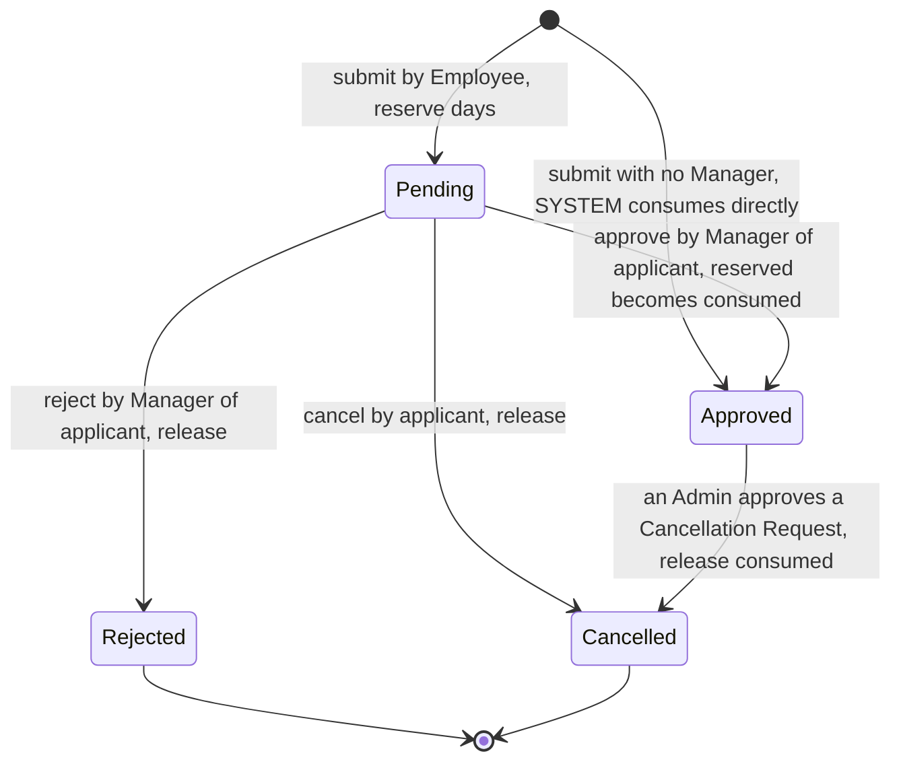
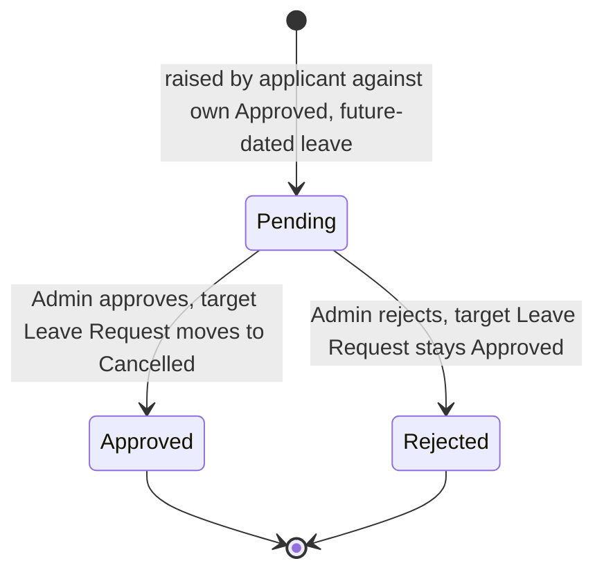
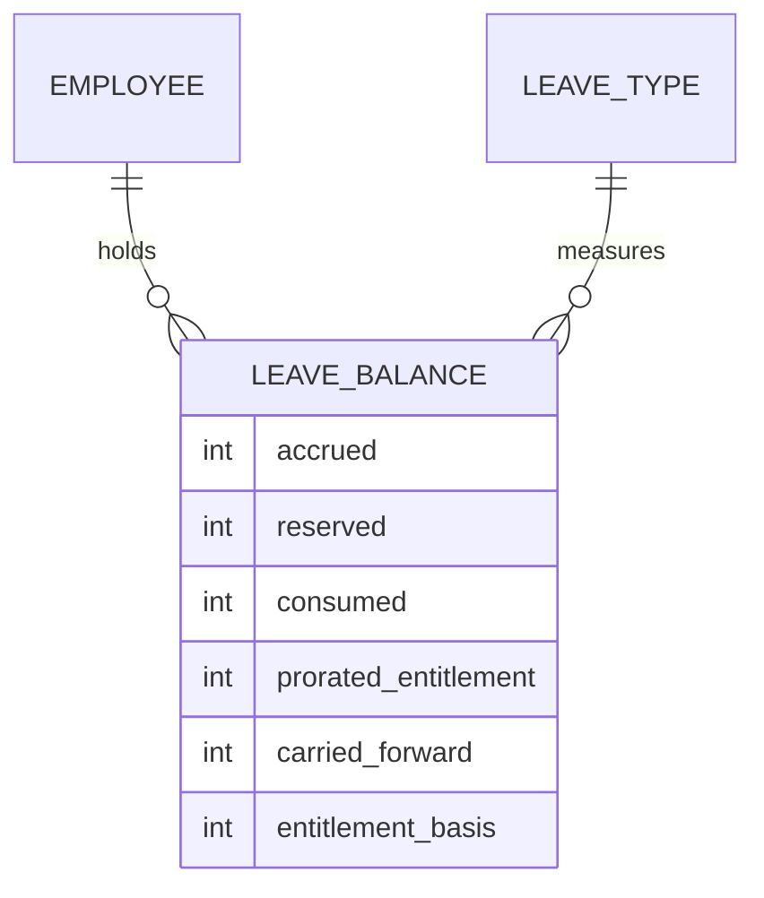
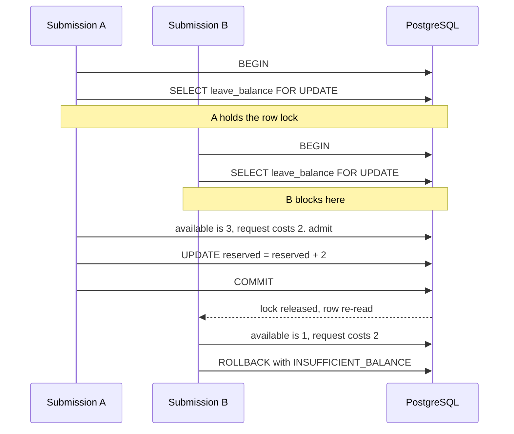
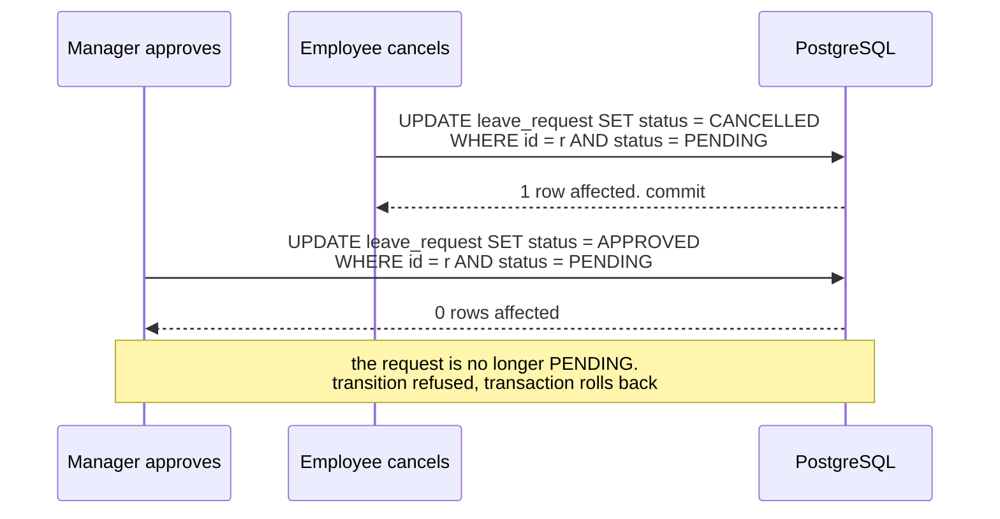

# LeaveFlow — Solution Architecture

## 0. How to read this document

This document explains **why** LeaveFlow is built the way it is. Its companion, [`ARCHITECTURE-SPINE.md`](ARCHITECTURE-SPINE.md), states **what** must be true — twenty-two numbered invariants (`AD-1` … `AD-22`) that every epic and every story must obey. The spine is terse on purpose and carries no reasoning. This document carries the reasoning, the alternatives that were rejected, and the diagrams. [`api-contracts.md`](api-contracts.md) fixes the API surface, the scope of every endpoint, and the error vocabulary.

The append-only decision log for the run is `.memlog.md`. The eight independent reviews that shaped these documents are in [`reviews/`](reviews/).

Requirement identifiers (`FR-nn`), domain rules (`DR-n`), non-functional requirements (`NFR-nn`) and success metrics (`SM-n`) are those of the [PRD](../../prds/prd-LeaveFlow-2026-07-09/prd.md) and Module 1, used unchanged. Section 9 lists four places where those documents contradict themselves or fall short, and what this architecture does about each.

## 1. What is actually hard here

LeaveFlow is a small system. Twenty functional requirements, three roles, one organization, a handful of users. Almost all of it is CRUD, and CRUD is not where a leave system fails.

It fails in four places, and the architecture is shaped around exactly those four.

**A Leave Balance is three numbers, and they move together** (§5). `Available = Accrued − Consumed − Reserved` must hold after every transition (`DR-3`), and `Available ≥ 0` must never be violated — including when two requests are submitted at the same instant (`DR-5`, `SM-1`). A balance that is wrong is worse than a balance that is absent, because it will be believed.

**A Leave Day count is not a date subtraction** (§3, §4). Weekend days and Company Holidays are excluded (`DR-1`). The rule has exactly one correct implementation, and the PRD's own addendum predicts where a second one will appear: the frontend, computing a preview.

**Authority comes from a relationship, not a job title** (§7). A Manager may decide their Direct Reports' requests and no others (`DR-12`). A Manager who is not *this* applicant's Manager must be indistinguishable, to the system, from a stranger.

**The Leave Year boundary is where leave systems break** (§6). Carry-Forward, Lapse, Proration, and a request left Pending across midnight on 31 December all interact. This turned out to be the deepest problem in the system, and §6 is about it.

Everything else — departments, profiles, dashboards, CSV export — is scaffolding around these four.

## 2. Context and containers

LeaveFlow is one deployment per organization. There is no tenancy model in the schema; a second organization means a second deployment with its own database (`PRD §6`). This is deliberate, and it is expensive to reverse.



There are no external systems. Payroll, attendance, email and SSO are all explicitly out of scope, which is why the architecture needs no adapter layer, no message bus, and no retry semantics.



Reproducible setup (`NFR-21`) is three commands: `docker compose up`, `alembic upgrade head`, then the seed command.

## 3. The design paradigm, and why not the alternatives

`NFR-13` requires that routes, business logic and data access be separated, with policy in the service layer. That settles the *layering*. It does not settle what sits beneath it, and that turned out to matter.

The chosen paradigm is **layered around a functional core** — Bernhardt's functional core / imperative shell, wrapped in the layering `NFR-13` asks for.



`domain/` holds the Leave Day count, Proration, Carry-Forward and the balance algebra. It imports no ORM, no web framework, and performs no I/O.

Two consequences pay for the choice. First, `NFR-08`'s "exactly one implementation, and a second one anywhere is a defect" stops being an aspiration a reviewer must police, and becomes a structural fact: weekend-and-holiday logic can only be *expressed* in a package that has no way to reach a database, so it cannot be reimplemented in a route or a repository. Second, `SM-2`'s boundary tests need no database fixture — which matters when the entire implementation budget is three days.

**Classic three-layer** was rejected. It satisfies `NFR-13` exactly and nothing more, and it leaves `count_leave_days` living in a service that also holds a database session. Nothing structural then prevents the second implementation `DR-2` forbids.

**Hexagonal / ports-and-adapters** was rejected. It buys swappable adapters behind Protocol interfaces. `PRD §6` disclaims ever needing to swap anything: one organization, one deployment, one database, no external systems. The interface indirection costs implementation hours the budget does not have, and buys nothing the functional core does not already provide.

## 4. Technology, and how each version was established

The backend framework and the frontend library were fixed upstream: **FastAPI** (`D-05`, chosen because typed models generate the OpenAPI document that is itself a project deliverable) and **React** (`D-06`, chosen on familiarity). Everything else in the stack was open, and one thing was missing entirely.

**No source document names a database.** The brief, the BRD, the PRD and the addendum all name FastAPI and React and stop there. Three requirements bear on the choice: `DR-5` (`Available ≥ 0` under concurrency), `SM-1` (a concurrent double-submit test), and `DR-2a` (a Leave Date is a calendar `DATE`, never a timestamp).

**PostgreSQL 18** was chosen. The argument that settled it is about `SM-1`. On SQLite, the concurrent double-submit test passes — but it passes because SQLite serializes every writer globally, not because the design is correct. The test would go green on a design that still has the race. SQLite additionally has no native `DATE` type, which would demote `DR-2a` from a type the database enforces to a convention the team maintains, and it has no `SELECT … FOR UPDATE`.

PostgreSQL also permits one of this architecture's strongest moves, and it costs nothing:

```sql
CHECK (accrued - consumed - reserved >= 0)
```

`DR-5` stops being an invariant the service layer *promises* to uphold, and becomes one the storage engine will not let it violate.

A "SQLite in tests, Postgres in production" split was considered and rejected outright: it would run `SM-1` — a metric the PRD says a technical discussion will probe — on the one engine that cannot express the race it exists to catch.

### 4.1 Versions, verified rather than remembered

Every version was checked against PyPI, the npm registry and official release pages on 2026-07-10, then re-verified by an independent review pass. Three of the findings would have cost real time on Day 3.

| Trap | What almost every tutorial still says | What is actually true |
| --- | --- | --- |
| Password hashing (`NFR-01`) | `passlib[bcrypt]` | `passlib`'s last release was 1.7.4 in **October 2020**, and it breaks against modern `bcrypt`. Use `pwdlib`, or `bcrypt` directly. |
| JWT (`FR-02`) | `python-jose` | Carries **CVE-2024-33663** (CVSS 9.3). Use `PyJWT`. |
| ORM | "pin the latest SQLAlchemy" | **2.1 is still beta.** Pin the 2.0 line. |

Three pins are deliberately behind the newest release: SQLAlchemy at 2.0 (2.1 is beta), Python at 3.13 (3.14 is current; 3.13 has broader library compatibility), and TypeScript at 6.0.3 rather than 7.0.2 — the native Go rewrite, which shipped **two days** before this architecture was written. A three-day implementation budget cannot absorb a toolchain surprise.

### 4.2 Why the skeleton is hand-rolled

The official `fastapi/full-stack-fastapi-template` is current, actively maintained, and matches this stack almost exactly. Normally it would be the right starting point for a three-day build.

It was rejected on one specific ground. The template uses **SQLModel**, in which a single class serves as both the Pydantic API schema and the SQLAlchemy table. That fusion is precisely the coupling `AD-1` forbids: it makes it impossible for `domain/` to remain free of the ORM, which dissolves the structural guarantee that `DR-2` depends on. The template also ships email-based password recovery, which `PRD §6` excludes as a non-goal.

Its `docker-compose` and Alembic wiring are used as reference. The rest is written by hand, which also means every decision in the codebase is one that can be defended aloud — the point of `SM-6`.

## 5. The balance model

### 5.1 The lifecycles the balance responds to

Everything in this section and the next turns on these two state machines, so they come first.



Submitting **reserves** Leave Days. Approving **consumes** them. Rejecting and cancelling **release** them.

A **Cancellation Request** is a separate entity, not a fifth status (`DR-14`, `AD-13`). This is what makes "Approved, with a cancellation pending" representable at all.



### 5.2 Three quantities, one derived



`Available` is never stored (`DR-3`). The three provenance columns are not balance quantities; they exist because `FR-06` requires that when an Admin changes a Leave Type's policy, the Admin must **explicitly choose** whether existing Leave Balances are recalculated under the new policy or left as accrued under the old one. Without `entitlement_basis` recording what a row was accrued under, there is nothing to recalculate *from*.

Exactly one module writes these columns (`AD-17`). It exposes eight operations, and the reason the list is enumerated rather than left to taste is a bug the adversarial review found: a single shared `consume(days)` that does `reserved -= days; consumed += days` **crashes on the first managerless auto-approval**. `FR-09` admits such a request directly as Approved, consuming its Leave Days *without a reservation stage*. Decrementing `reserved` from zero violates `CHECK (reserved >= 0)`. So `consume_direct` exists as a distinct operation from `consume_reserved`.

### 5.3 Concurrency

`NFR-07` requires reserve, consume and release to be atomic. `FR-09` requires that when two conflicting transitions race, the first to commit succeeds and the second fails.

Two mechanisms, each solving a different problem.

**Competing submissions contend for a balance, not for a request.** They are serialized by a pessimistic row lock.



The subtle part, and the one an early draft of the spine got wrong: the `Available` value that **decides** admission must be read from the row *held under that lock*, in that transaction. An implementation that decides using the value the preview endpoint returned a moment earlier has a time-of-check-to-time-of-use gap, and would pass `SM-1` by luck. `AD-3` now says so explicitly, and names the isolation level (READ COMMITTED) rather than leaving it to be assumed.

**Competing decisions contend for a request.** They are resolved without any lock at all, by a guarded conditional update.



Zero rows affected *is* `FR-09`'s first-committed-wins. The Manager receives a failure, not a silent overwrite.

**The `CHECK` constraint is a backstop, not a gate.** This distinction is load-bearing. If the service relied on the constraint to catch an overspend, the user would receive a 500 from an `IntegrityError` — whereas `FR-08` and `NFR-17` require a refusal that *names the numbers*: Leave Days requested against Leave Days available. So the service pre-checks inside the lock and raises a typed domain error. A `CHECK` violation that ever reaches a client is a defect, not a refusal.

## 6. The Leave Year boundary, and a hole in the requirements

This is the part of the system that required the most work, and the part where the PRD — otherwise unusually complete, carrying no open questions of its own — turned out to have a gap. The gap has since been closed: `DR-7` was amended on 2026-07-10 to carry the definition this section derives.

### 6.1 The collision

`DR-7a` says that Reserved days held by a **Pending** Leave Request do not lapse at the boundary; they stay reserved against their own Leave Year until resolved. `DR-7` says unused **Accrued** days carry forward, up to the Carry-Forward Cap.

Neither rule says what "unused" means when some Accrued days are Reserved by a request that has not yet been decided.

Take Earned Leave with a Carry-Forward Cap of 10. On 31 December 2026 an Employee stands at Accrued 12, Consumed 8, Reserved 3 — a Pending request for 28–30 December. Available is 1. The rollover fires on 1 January.

| Rule you might pick | What it carries | What then goes wrong |
| --- | --- | --- |
| Carry `Available` | 1 day | On 5 January the Manager **rejects** the request. Reserved drops to 0, so 2026 shows 4 unused days — in a Leave Year that is closed. **The Employee loses three days of Earned Leave because their Manager was slow to click.** |
| Carry `Accrued − Consumed` | 4 days | On 5 January the Manager **approves** it. Consumed rises to 11. Those three days were spent in December *and* carried into January. **The balance is overstated by three.** |

The second failure is the dangerous one, because nothing catches it. The `CHECK` constraint holds in both Leave Years — each year's row is internally consistent. `SM-1`'s property test does not cover it, because the rollover is not a Leave Request state transition. It is exactly the failure the product exists to prevent: a number that is wrong, and believed.

### 6.2 The resolution

Carry-Forward is **derived, never accumulated** (`AD-6`):

```
carried_forward(Y+1) = min(carry_forward_cap, available(Y))
```

computed from Leave Year Y's *live* balance, written by assignment rather than by increment, and recomputed whenever year Y's balance changes.

Under Leave Request transitions this is safe, for a reason the balance model already guarantees. **Approval is a transfer from Reserved to Consumed.** Since `Available = Accrued − Consumed − Reserved`, approval leaves `Available` unchanged. Only rejection and cancellation move it, and they only ever move it up. So `available(Y)` is monotonically non-decreasing as year Y's Pending requests resolve, and Carry-Forward is only ever **topped up** — never clawed back. No double count, no silent loss.

Rollover idempotence, which the PRD explicitly leaves to Architecture, then falls out for free: because the job *assigns* a derived value rather than *adding* to an accumulated one, running it twice against the same Leave Year is a no-op. No guard table, no run-once flag.

### 6.3 Where that argument breaks, and what fixes it

The monotonicity argument above is **true only for Leave Request transitions**, and the first draft of this architecture over-claimed it. Three independent reviews caught the same defect.

Two other paths can lower `available(Y)`:

- **`FR-10`, deleting a Company Holiday** inside a Pending request's date range. That date becomes a Working Day again, so the request's `leave_days` rises, so Reserved rises, so Available falls.
- **`FR-06`, lowering a Leave Type's `carry_forward_cap` or `annual_entitlement`** with the disposition RECALCULATE. This lowers `carried_forward` *directly*. Worse: a policy change is not a balance change, so the recompute trigger as originally stated would never have fired at all.

If `carried_forward(Y+1)` falls, `accrued(Y+1)` falls with it — and if Leave Year Y+1 has already been spent, the `CHECK` constraint aborts the Admin's transaction. The Admin's holiday edit fails with a database error.

`AD-19` fixes this, and it does so by generalizing a rule the PRD had already written for a narrower case. `FR-10` said a recalculation that would drive a balance negative is **refused, left unchanged, and flagged for Admin review** — but only in the Leave Year being edited, and only for a holiday change. `AD-19` extends exactly that rule to `FR-06`'s policy recalculation and to *downstream* Leave Years. The check runs inside the same transaction, independently per Employee **and Leave Type**; where it would fail, that pair is left entirely untouched — the same Employee's other Leave Types still proceed — a flag is raised, and the rest of the operation proceeds. `FR-10` and `FR-06` were amended on 2026-07-10 to carry this.

`AD-20` then gives "flagged for Admin review" somewhere to live. The PRD named the behavior but not a table. Without `AD-20`, two epics would invent two exception stores and the Admin surface would read neither. The store is read-only: `FR-10` grants the Admin the read, and no requirement grants a resolve, so nothing clears a flag.

## 7. Authorization

`DR-12` grants a Manager authority through the **Direct Report relationship**, not through the Manager role. The reporting edge is a nullable self-referencing `manager_id` column on `employee`. A standalone relation was considered and rejected: `DR-12` evaluates authority at decision time, so a history of who managed whom is never needed, and a column makes `NFR-04`'s in-query scoping a predicate rather than a join.

`AD-10` fixes three things that epics would otherwise decide differently:

- **No repository exposes an unscoped getter.** There is no `get_leave_request(id)`. Every read that could return another Employee's data takes the actor and applies the scope *in the SQL*. `NFR-04` is not a code-review guideline; it is the only available API.
- **A resource outside the actor's scope returns 404**, byte-identical to a nonexistent resource. `FR-03` demands this in so many words. A 403 would disclose that the request exists.
- **403 is reserved** for a resource the actor may see but not act upon.

The `manager_id` column also carries `FR-09`'s auto-approval: an Employee with no Manager has no possible approver, so their request is approved on submission by `SYSTEM`. That path is dangerous — an Admin who deactivated a Manager could silently create it. `AD-22` closes the hole by refusing to deactivate any Employee who is still named as a Manager by an active Employee. Auto-approval is reachable only for someone who genuinely never had a Manager.

## 8. Audit

`DR-16` and `SM-4` require **exactly one** Audit Entry per state transition, counted one-to-one, append-only.

`FR-07` used to say the rollover's "Audit Entries record the actor `SYSTEM`". But the PRD's own glossary defines an Audit Entry as *a record of one Leave Request state transition*, and the rollover transitions no Leave Request. Had rollover rows been written into `audit_entry`, **`SM-4` would have been false the day it was written** — and `SM-4` is one of the four primary success metrics.

`AD-8` resolves it: `audit_entry` holds transitions of Leave Requests and Cancellation Requests, and nothing else. The rollover writes to a separate append-only `rollover_run` table. `SM-4`'s one-to-one count stays literally true. `FR-07` was amended on 2026-07-10 to say exactly this.

Two details matter. `actor_id` is a **nullable** foreign key, NULL exactly when the actor is `SYSTEM` — nullable rather than absent, so referential integrity survives a non-human actor. And the audit row is inserted inside the transition's own transaction, so a rolled-back transition leaves no entry behind and the one-to-one count holds under failure.

`AD-9` makes append-only structural rather than aspirational: the application's database role is granted `INSERT` and `SELECT` on the audit tables and is granted **neither `UPDATE` nor `DELETE`**. Migrations run as the owner. `NFR-09` therefore holds against code that has not been written yet.

## 9. Defects found in the upstream documents

Five. **All five were amended into the PRD on 2026-07-10**, and each is recorded in the spine's *Upstream Amendments — Applied* section. The fifth was surfaced later, by the Module 4 ERD.

1. **`DR-7` and `DR-7a` do not compose** (§6.1). Neither says what "unused Accrued days" means when some are Reserved by a request Pending across the boundary. Either the Employee silently loses days or the balance is silently overstated. The most consequential of the four; resolved by `AD-6` and `AD-19`.
2. **`FR-14`'s mark-read mutation has no requirement.** `FR-11` requires an unread count that decrements when a Notification is read. Nothing specifies the transition that decrements it. The addendum calls this "the smallest absence in the document"; `AD-16` supplies the surface.
3. **`FR-07` contradicts the glossary and `SM-4`** (§8). The rollover cannot write Audit Entries without falsifying `SM-4`'s one-to-one count. Resolved by `AD-8`.
4. **`FR-10`'s refuse-and-flag rule is too narrow, and has no store** (§6.3). It covers holiday recalculation in the edited Leave Year only, while `FR-06`'s policy recalculation can fail the same way and both can corrupt a *downstream* year. Resolved by `AD-19` and `AD-20`.
5. **The Vision's attribution promise was not kept for policy or holiday changes.** `PRD §1` promised "every state change is attributable to an actor and a moment", while `FR-16` and `NFR-19` delivered attribution only for Leave Request transitions. An Admin can lower a `carry_forward_cap`, reshape Leave Balances across Leave Years (§6.3), and leave no record of who did it. Surfaced by the Module 4 ERD. **The PM narrowed the Vision rather than widening the requirements**: §1 now reads "Every Leave Request state change is attributable to an actor and a moment." Policy and holiday edits remain deliberately unattributed, and the PRD no longer promises otherwise.

Finding these is part of what this stage is for. None was resolved by guessing; each is resolved against the PRD's own stated rules, and each is routed back upstream rather than absorbed silently.

## 10. Operations

Nothing in any source document says how LeaveFlow is deployed, run, or scheduled. Those decisions are made here.

**The rollover is a CLI job, not a background thread.** `python -m app.jobs.rollover --year 2027`, invoked by cron. An `APScheduler` registered on FastAPI startup was rejected: with `uvicorn --workers 4` you get four schedulers, and the job fires four times. Idempotence would save the data, but four concurrent jobs would still contend for the same row locks. As a CLI entrypoint the job is also directly callable from a test — which is what `NFR-15` needs to test the Leave Year boundary, with no running server and no clock to mock.

**Configuration comes from the environment** via `pydantic-settings`. `.env` is never committed; `.env.example` is (`NFR-20`).

**Leave Types are seeded as data, never as a migration and never as constants.** `SM-5` requires a fourth Leave Type to be addable with no code change *and no schema migration*. That forces `leave_type` to be a table row and forbids a PostgreSQL `ENUM`. The mirror-image decision is that `leave_request.status` *is* code — four states the application must handle exhaustively — stored as `TEXT` with a `CHECK`, again not an `ENUM`, whose value set cannot be extended without a migration.

EL, CL and FL are seeded with `requires_supporting_document` set to **false**. `PRD §7.3` raised, and declined to answer, whether any seeded Leave Type demands a document; it is now settled by project decision that none does. An Admin may enable the flag per Leave Type at any time (`FR-06`). Doing so before `FR-13` ships in Phase 3 would leave the requirement configurable but unenforced — a deliberate, Admin-triggered risk rather than a latent one.

**Observability** is structured JSON logs to stdout and a `/health` endpoint. Metrics and error monitoring are deferred; Module 1's NFR set does not require them.

## 11. Risks and accepted limitations

- **Earned Leave above the Carry-Forward Cap is forfeited.** `AD-6`'s `min(cap, available)` discards the excess. Indian statute generally requires earned leave above a cap to be *encashed* rather than forfeited, and encashment is a `PRD §6` non-goal. Accepted for a trainee project; a production deployment must address it first. Recorded, not designed around.
- **A holiday edit stalls submissions organization-wide** for the duration of its transaction, because `AD-19` locks every affected balance row. Acceptable at this data scale (`NFR-10`).
- **Nothing bounds how long a Leave Request may stay Pending.** A 2026 request still Pending when 2028 is materialized forces Carry-Forward recomputation to propagate across two open Leave Years. Routed to the PM as an open question.
- **Phase 3 is the part most likely to go undelivered** (`FR-13` upload, `FR-15` export). The architecture reserves no seam for them beyond `AD-15`; if the budget runs out, `SM-8` is missed and reported as a miss.
- **A password is set once, by an Admin, and never again.** `FR-04` has the Admin supply an Employee's initial password, communicated out of band; `PRD §6` excludes every change, reset and re-issue path. Four consequences, all recorded in `PRD §6` and none designed around: an Employee who forgets their password has no recovery path; the lockout is permanent, because `FR-04` forbids deletion and `UNIQUE (email)` on a row that persists forever means the address is never reusable; `FR-16`'s attribution binds an *account* rather than a person, since the Admin knows every password and none is rotated; and a compromised credential can be revoked only by a deactivation that `AD-22` may refuse and that no endpoint reverses. Accepted for a trainee project. The architecture reserves no seam for a reset flow — adding one later means a new endpoint and a token type, not a rearrangement of the spine.
- **All twenty-one NFRs are engineer-proposed and unconfirmed.** The architecture funds `NFR-03`, `NFR-04`, `NFR-07` and `NFR-08` most heavily, on the PRD's judgment that these are what a technical discussion probes.

## 12. Traceability

Every requirement resolves to an invariant. The full map is in the spine's *Capability → Architecture Map*; the load-bearing rows are:

| Requirement | Invariant that governs it |
| --- | --- |
| `DR-2` / `NFR-08` one Leave Day count implementation | `AD-1`, `AD-2`, `AD-18` |
| `DR-3` / `DR-5` / `SM-1` balance correctness | `AD-3`, `AD-5`, `AD-17` |
| `DR-7` / `DR-7a` Leave Year boundary | `AD-6`, `AD-19`, `AD-20` |
| `DR-12` / `NFR-04` / `SM-3` data-scoped authority | `AD-10`, `AD-22` |
| `DR-16` / `NFR-09` / `SM-4` audit | `AD-8`, `AD-9`, `AD-21` |
| `DR-11` / `NFR-14` / `SM-5` policy as data | `AD-11` |
| `FR-09` first-committed-wins | `AD-4` |
| `DR-2a` Leave Dates are not instants | `AD-12` |
| `DR-14` / `BR-05` approved-leave cancellation | `AD-13`, `AD-17` |
