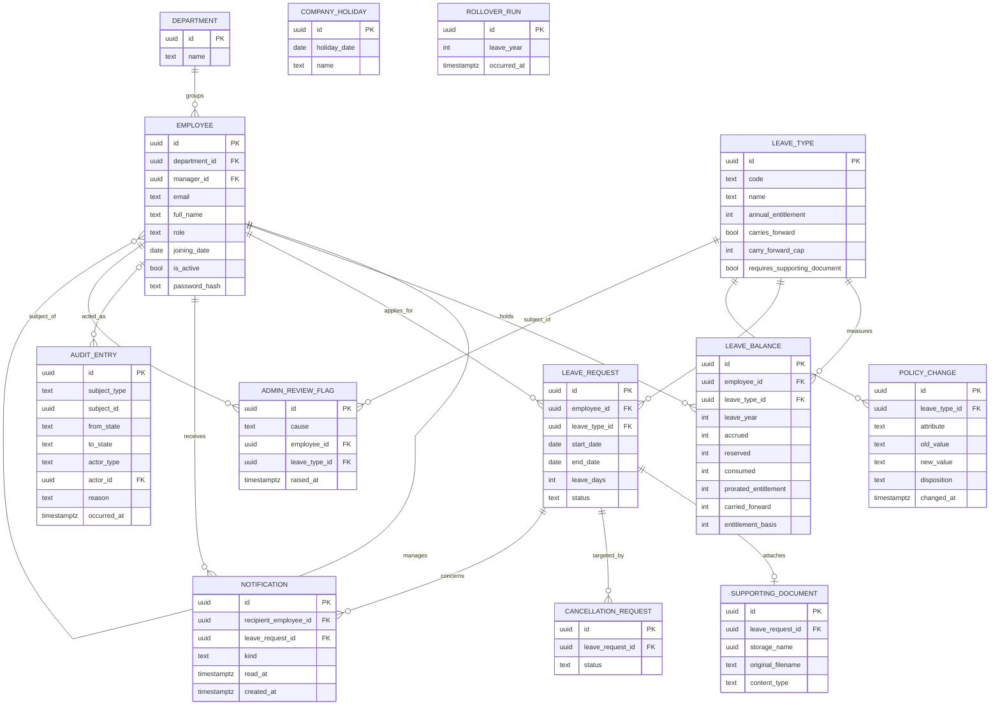

# LeaveFlow — Entity Relationship Diagram

## 0. Scope, inputs, and method

This is the Module 4 deliverable: the data model for LeaveFlow. Its authoritative inputs are the finalized [PRD](../prds/prd-LeaveFlow-2026-07-09/prd.md), the [Architecture Spine](../architecture/architecture-LeaveFlow-2026-07-10/ARCHITECTURE-SPINE.md) (`AD-1` … `AD-22`), the [solution architecture](../architecture/architecture-LeaveFlow-2026-07-10/architecture.md), and the [API contracts](../architecture/architecture-LeaveFlow-2026-07-10/api-contracts.md).

**Method.** Every entity, attribute and relationship below is *derived* from an existing requirement (`FR-nn`), domain rule (`DR-n`), business rule (`BR-nn`), engineering decision (`D-nn`) or architecture decision (`AD-nn`). Each carries its source. Nothing is invented. Where the requirements do not supply something the schema needs, it is **not** filled in — it is raised in §6 and left open.

**What this document is not.** It is not the DDL. Alembic owns the schema (`AD-11`), and the generated migrations are the physical artifact. §4 states the physical choices this model implies; it does not restate them as SQL scripts, and no migration file is produced here, because the learning path lists an ERD and not a migration.

**Two levels, kept apart.** §2 and §3 are the **logical model**: what exists, what it means, and how things relate. §4 is the **physical model**: PostgreSQL 18 types, keys, constraints, indexes and grants. A reader may disagree with §4 without disturbing §2.

## 1. Modelling rules in force

| Rule | Source |
| --- | --- |
| One organization per deployment. **No organization, tenant, or company column exists on any table.** A second organization is a second deployment with its own database. | `PRD §6`, `A-07`, spine *Deferred* |
| A Leave Type is **data** — a row, never an enum, never a constant. A fourth type is addable with no code change and no schema migration. | `DR-11`, `AD-11`, `SM-5` |
| A Leave Request status is **code** — four states the application handles exhaustively. | `AD-11`, `AD-21` |
| `Available` is derived, never stored. Three quantities are stored. | `DR-3`, `AD-5` |
| A Cancellation Request is a **separate entity**, not a fifth status. | `DR-14`, `AD-13` |
| `audit_entry` is append-only and holds **transitions only**. The rollover writes elsewhere. | `AD-8`, `AD-9`, `SM-4` |
| A Leave Date is a calendar date, never an instant. | `DR-2a`, `AD-12` |
| A Leave Day is a whole number. No fractional quantity is expressible. | `DR-10`, spine *Conventions* |
| Enumerated strings are `UPPER_SNAKE_CASE`, declared once. | `AD-21` |

## 2. Logical model

`COMPANY_HOLIDAY` and `ROLLOVER_RUN` stand alone by design. A Company Holiday is global to the organization and is scoped to no Department or location (`FR-10`, `A-03`). `ROLLOVER_RUN` records job executions, not domain objects (`AD-8`).

`AUDIT_ENTRY` binds to its subject **polymorphically**, through `subject_type` and `subject_id`. That relationship carries no foreign key and therefore no line to `LEAVE_REQUEST` or `CANCELLATION_REQUEST` above. The only foreign key it has is `actor_id` (`AD-8`).

### 2.1 Attribute provenance

Every attribute, and the requirement it comes from. An attribute with no source would be an invention; there are none, and where the requirements are silent the row is absent and the gap is raised in §6.

**DEPARTMENT** — `FR-05`

| Attribute | Meaning | Source |
| --- | --- | --- |
| `name` | The Department's name; a refusal to delete "names the obstruction" | `FR-05` |

**EMPLOYEE** — `FR-04`, `FR-17`, `DR-12`

| Attribute | Meaning | Source |
| --- | --- | --- |
| `department_id` | Every Employee belongs to exactly one Department | `PRD §3` glossary, `FR-04` |
| `manager_id` | Nullable self-reference. The Direct Report relationship *is* the authorization scope. NULL is the condition `FR-09`'s auto-approval keys on. | `DR-12`, `FR-09`, `AD-10`, `AD-22` |
| `email` | The credential identity `FR-01` exchanges for a session. Maintained by the Admin (`FR-04`); not editable by its owner (`FR-17`). | `PRD §3` Glossary, `FR-01`, `FR-04` |
| `full_name` | The human-readable identity `FR-19`'s team list displays, and the only field `FR-17`'s profile edit may change. | `PRD §3` Glossary, `FR-17`, `FR-19` |
| `role` | Exactly one of three. Roles are code, not data — the specification forbids adding a fourth. | `FR-03`, `PRD §9`, `AD-21` |
| `joining_date` | The basis of Proration | `FR-04`, `DR-9` |
| `is_active` | Deactivation, never deletion. Preserves requests, balances and audit entries. | `FR-04`, `AD-22` |
| `password_hash` | Salted hash; no reversible representation exists. Written once, from the initial password the **Admin** supplies at creation (`FR-04`); no path updates it. | `FR-01`, `FR-04`, `NFR-01`, `AD-14` |

`email` and `full_name` originated as project decisions taken during this ERD, because no source document named them. They were amended into the PRD on 2026-07-10 — as Glossary terms plus one `FR-17` acceptance criterion, deliberately **not** as new functional requirements, which would have changed `SM-8`'s twenty-requirement denominator. The PRD is now their source of record. §6, GAP-1 and GAP-2, preserve the history.

**LEAVE_TYPE** — `FR-06`, `DR-11`, `AD-11`

| Attribute | Meaning | Source |
| --- | --- | --- |
| `code` | `EL`, `CL`, `FL`, seeded as data | `BR-01`, `AD-11` |
| `name` | `FL` denotes Floater Leave | `FR-06` note, `A-04` |
| `annual_entitlement` | Leave Days granted for a full Leave Year; the base quantity Proration reduces | `PRD §3` glossary, `FR-06` |
| `carries_forward` | Read at runtime. No branch tests a Leave Type by name. | `BR-03`, `DR-11`, `AD-11` |
| `carry_forward_cap` | The maximum carried across the boundary. No cap is fixed in code. Meaningless when `carries_forward` is false. | `FR-06`, `DR-7` |
| `requires_supporting_document` | Seeded **false** for EL, CL and FL by project decision | `FR-06`, `FR-13`, spine *Seeding* |

**COMPANY_HOLIDAY** — `FR-10`

| Attribute | Meaning | Source |
| --- | --- | --- |
| `holiday_date` | A single dated day. Not a Working Day, therefore not a Leave Day. | `FR-10`, `DR-1` |
| `name` | "A Company Holiday is a date and a name." Named on screen at preview time. | `FR-10`, `UJ-1`, `AD-2` |

**LEAVE_BALANCE** — `FR-07`, `DR-3`, `AD-5`, `AD-6`, `AD-17`

| Attribute | Meaning | Source |
| --- | --- | --- |
| `leave_year` | The calendar year, 1 January to 31 December | `DR-8` |
| `accrued` | Granted, after Proration and Carry-Forward | `DR-3` |
| `reserved` | Committed to Pending requests; unspendable | `DR-3`, `D-01` |
| `consumed` | Deducted by Approved requests | `DR-3` |
| `prorated_entitlement` | The entitlement portion of `accrued` | `DR-9`, `AD-5` |
| `carried_forward` | The carried portion of `accrued`. Derived, never accumulated. | `DR-7`, `AD-6` |
| `entitlement_basis` | The Annual Entitlement this row was accrued under. Without it, `FR-06`'s RECALCULATE disposition has nothing to recalculate *from*. | `FR-06`, `AD-5` |

`Available` is absent by rule. It is `accrued − consumed − reserved`, and it is never stored (`DR-3`).

**LEAVE_REQUEST** — `FR-08`, `FR-09`, `AD-18`

| Attribute | Meaning | Source |
| --- | --- | --- |
| `start_date`, `end_date` | A contiguous range, never spanning two Leave Years | `FR-08`, `BR-04`, `DR-6` |
| `leave_days` | Working Days in the range. **Computed once at admission and frozen.** No read path recomputes it. | `DR-1`, `DR-2`, `AD-2`, `AD-18` |
| `status` | `PENDING`, `APPROVED`, `REJECTED`, `CANCELLED` | `PRD §4.5`, `AD-21` |

No `created_at`. Creation is itself a transition and is recorded in `audit_entry` (`DR-16`); ordering comes free from the time-ordered UUIDv7 primary key (spine *Conventions*). No reason or comment field: no requirement asks for one.

**CANCELLATION_REQUEST** — `DR-14`, `AD-13`

| Attribute | Meaning | Source |
| --- | --- | --- |
| `leave_request_id` | The one Approved Leave Request it targets | `DR-14` |
| `status` | `PENDING`, `APPROVED`, `REJECTED` — its own lifecycle, not the Leave Request's | `DR-14`, `AD-13`, `AD-21` |

No requester column: only the applicant may raise one, so the requester is `leave_request.employee_id` (`FR-09`). No decider column: the Admin who decided it is the actor on its `audit_entry` transition (`AD-8`).

**SUPPORTING_DOCUMENT** — `FR-13`, `NFR-05`, `AD-15`

| Attribute | Meaning | Source |
| --- | --- | --- |
| `leave_request_id` | At most one document per Leave Request | `FR-13` |
| `storage_name` | Server-generated opaque name on a volume outside the web root | `NFR-05`, `AD-15` |
| `original_filename` | Persisted as **data**; never used as a path component | `NFR-05`, `AD-15` |
| `content_type` | One of PDF, JPG/JPEG, PNG; required to serve the stream | `FR-13` |

No `size_bytes`: size is validated before the bytes are written (`FR-13`) and no requirement reads it afterwards.

**NOTIFICATION** — `FR-14`, `AD-16`

| Attribute | Meaning | Source |
| --- | --- | --- |
| `recipient_employee_id` | Readable only by its addressee | `FR-14` |
| `leave_request_id` | The request it concerns | `AD-16` |
| `kind` | `REQUEST_SUBMITTED`, `REQUEST_APPROVED`, `REQUEST_REJECTED` | `FR-14`, `AD-16`, `AD-21` |
| `read_at` | Nullable. Read-state *is* this column; the unread count is `COUNT(*) WHERE read_at IS NULL` and is never stored. | `FR-11`, `AD-16` |
| `created_at` | Ordering | `AD-16` |

**AUDIT_ENTRY** — `FR-16`, `DR-16`, `AD-8`, `AD-9`

| Attribute | Meaning | Source |
| --- | --- | --- |
| `subject_type` | `LEAVE_REQUEST` or `CANCELLATION_REQUEST` | `AD-8`, `AD-21` |
| `subject_id` | Polymorphic; carries no foreign key | `AD-8` |
| `from_state` | Nullable — a creation transition has no from-state | `PRD §4.5` state table |
| `to_state` | The state entered | `DR-16` |
| `actor_type` | `EMPLOYEE` or `SYSTEM` | `FR-16`, `AD-8` |
| `actor_id` | Nullable FK to Employee, NULL if and only if `actor_type` is `SYSTEM`. **Not a `NOT NULL` FK**, because `SYSTEM` must be expressible. | `FR-16`, `AD-8`, addendum §3.2 |
| `reason` | `AUTO_APPROVED_NO_MANAGER` for a managerless auto-approval. No human approver is fabricated. | `FR-16`, `FR-09` |
| `occurred_at` | The moment | `DR-16`, `NFR-19` |

Exactly one row per transition. A cancellation writes entries for **both** objects: the Cancellation Request's own transitions, and the Leave Request's move to `CANCELLED` (`DR-14`, `SM-4`).

**ROLLOVER_RUN** — `AD-7`, `AD-8`

| Attribute | Meaning | Source |
| --- | --- | --- |
| `leave_year` | The Leave Year rolled | `FR-07` |
| `occurred_at` | The moment. Actor is always `SYSTEM`; no column is needed to say so. | `FR-07`, `AD-7` |

Separate from `audit_entry` so that `SM-4`'s one-to-one count against transitions stays literally true (`AD-8`).

**ADMIN_REVIEW_FLAG** — `AD-19`, `AD-20`

| Attribute | Meaning | Source |
| --- | --- | --- |
| `cause` | Which refusal raised it: a holiday recalculation, or a policy recalculation | `FR-10`, `FR-06`, `AD-19` |
| `employee_id`, `leave_type_id` | The subject. `AD-19` refuses **per Employee and Leave Type**, so the pair is the subject; that Employee's other Leave Types still proceed. | `FR-10`, `FR-06`, `AD-19`, `AD-20` |
| `raised_at` | When the refusal occurred | `FR-10`, `AD-20` |

The table is **append-only in practice and read-only to the Admin**. `FR-10` grants the Admin the read and no requirement grants a resolve, so there is no `resolved_at` column and no endpoint clears a flag. A flag is a permanent record that a recalculation was refused.

**POLICY_CHANGE** — `FR-06`, `AD-20`

| Attribute | Meaning | Source |
| --- | --- | --- |
| `leave_type_id` | The Leave Type changed | `FR-06` |
| `attribute`, `old_value`, `new_value` | Which attribute changed, and how | `AD-20` |
| `disposition` | `RECALCULATE` or `PRESERVE`. `FR-06` forbids applying the change until this is chosen and recorded. | `FR-06`, `AD-20`, `AD-21` |
| `changed_at` | The moment | `AD-20` |

**No actor column, by decision.** `PRD §1` promises attribution for **Leave Request** state changes only, and `FR-16` and `NFR-19` deliver exactly that. A policy change is therefore recorded without an actor, deliberately. See §6, GAP-3.

## 3. Relationships

| Parent | Child | Cardinality | Meaning | Source |
| --- | --- | --- | --- | --- |
| `department` | `employee` | 1 → 0..* | Every Employee belongs to exactly one Department. A Department with Employees cannot be removed. | `FR-05`, `PRD §3` |
| `employee` | `employee` | 0..1 → 0..* | The Direct Report relationship. Nullable: an Employee may have no Manager. | `DR-12`, `FR-09` |
| `employee` | `leave_balance` | 1 → 0..* | One row per Employee, Leave Type and Leave Year | `DR-3`, `AD-5` |
| `leave_type` | `leave_balance` | 1 → 0..* | " | `DR-3` |
| `employee` | `leave_request` | 1 → 0..* | The applicant | `FR-08` |
| `leave_type` | `leave_request` | 1 → 0..* | The category applied for | `FR-08` |
| `leave_request` | `supporting_document` | 1 → 0..1 | At most one document | `FR-13` |
| `leave_request` | `cancellation_request` | 1 → 0..* | Zero or more over time. A *rejected* Cancellation Request "changes nothing" (`FR-09`), and no rule forbids raising another; the model does not forbid what the requirements permit. | `DR-14`, `AD-13` |
| `employee` | `notification` | 1 → 0..* | The addressee | `FR-14` |
| `leave_request` | `notification` | 1 → 0..* | Submission notifies the Manager; a decision notifies the applicant | `FR-14` |
| `employee` | `audit_entry` | 0..1 → 0..* | The actor. Optional, because the actor may be `SYSTEM`. | `AD-8` |
| `leave_type` | `policy_change` | 1 → 0..* | Every attribute change, with its disposition | `FR-06`, `AD-20` |
| `employee` + `leave_type` | `admin_review_flag` | 1 → 0..* | The refused subject | `AD-19`, `AD-20` |
| *(none)* | `company_holiday` | — | Global to the organization; scoped to no Department or location | `FR-10`, `A-03` |
| *(none)* | `rollover_run` | — | A job-execution record, not a domain object | `AD-7`, `AD-8` |

**Polymorphic, and deliberately outside the foreign-key graph:** `audit_entry.subject_id` points at a Leave Request *or* a Cancellation Request, discriminated by `subject_type`. Referential integrity for the subject is not enforceable by the database. This is a known consequence of `AD-8`'s decision to keep one audit table, taken so `SM-4`'s count is a single query.

## 4. Physical model — PostgreSQL 18

Everything above is logical. Everything below is an implementation choice, and a reader may disagree with it without disturbing §2 or §3.

### 4.1 Keys and types

| Choice | Value | Source |
| --- | --- | --- |
| Primary keys | `UUID DEFAULT uuidv7()` — native in PostgreSQL 18, no extension. Time-ordered, so it also supplies creation order; non-enumerable, which keeps `AD-10`'s 404 honest. | spine *Conventions*, `AD-10` |
| Leave dates | `DATE`. Never `TIMESTAMPTZ`. | `DR-2a`, `AD-12` |
| Instants | `TIMESTAMPTZ` | `AD-12` |
| Leave quantities | `INTEGER`. Never `NUMERIC`, never float. | `DR-10` |
| Enumerated strings | `TEXT` + `CHECK`. **Never a PostgreSQL `ENUM`**, whose value set cannot be extended without a migration. | `AD-11`, `AD-21` |
| Leave Type | A **table row**, seeded by a seed command, never by a migration and never as a constant. | `AD-11`, `SM-5` |

### 4.2 Constraints

On `leave_balance` (`AD-5`):

- `CHECK (accrued - consumed - reserved >= 0)` — `DR-5` becomes unstorable-if-violated
- `CHECK (reserved >= 0 AND consumed >= 0)`
- `CHECK (accrued = prorated_entitlement + carried_forward)` — **not deferrable**, so all three columns move in one statement (`AD-5`, `AD-17`)
- `UNIQUE (employee_id, leave_type_id, leave_year)`

These are a **backstop, never a gate.** The service pre-checks inside the row lock and raises `INSUFFICIENT_BALANCE` with its numbers; a `CHECK` violation reaching a client is a defect and a 500 (`AD-5`, `NFR-17`).

Elsewhere:

- `employee`: `UNIQUE (email)`. `FR-04` forbids deletion, so a deactivated Employee's row — and their email — persist indefinitely and the address is never reusable. `FR-01`'s byte-identical failure response must therefore not leak through lookup timing either.
- `leave_request`: `CHECK (status IN ('PENDING','APPROVED','REJECTED','CANCELLED'))`, `CHECK (end_date >= start_date)` (`FR-08`), `CHECK (leave_days > 0)` (`FR-08`: a zero-day request is refused)
- `cancellation_request`: `CHECK (status IN ('PENDING','APPROVED','REJECTED'))`
- `employee`: `CHECK (role IN ('EMPLOYEE','MANAGER','ADMIN'))` — roles are code; the specification forbids a fourth (`PRD §9`)
- `employee`: `CHECK (id <> manager_id)` — *added 2026-07-10 (`G7`, `AD-23`).* A **backstop only**: it catches the self-reference, not a transitive cycle A → B → A. The gate is the employee service, which walks the reporting chain inside the assignment transaction and refuses a cycle with `400 REPORTING_CYCLE`. Without acyclicity, an Employee who is their own Manager approves their own leave — `FR-09` grants approval to "the Manager of the applicant" and `DR-12` derives that authority from the relationship rather than the role, so the check passes and `SM-3` still reports green, because self-approval genuinely *is* data-scoped.
- `audit_entry`: `CHECK ((actor_type = 'SYSTEM') = (actor_id IS NULL))` — makes `AD-8`'s "NULL if and only if SYSTEM" a database fact
- `company_holiday`: `UNIQUE (holiday_date)` — a date is a Company Holiday or it is not
- `leave_type`: `UNIQUE (code)`
- `supporting_document`: `UNIQUE (leave_request_id)` — enforces the 0..1

A Leave Request may not span two Leave Years (`BR-04`, `DR-6`). That is enforced in `domain/` rather than by a `CHECK`, because "same calendar year" is a property of the pair and the refusal must carry the boundary date in its message (`NFR-17`).

### 4.3 Grants — append-only is a grant, not a habit

The application's database role is granted `INSERT` and `SELECT` on `audit_entry` and `rollover_run`, and is granted **neither `UPDATE` nor `DELETE`**. Alembic migrations run under the owner role (`AD-9`, `NFR-09`). `NFR-09` therefore holds against code that has not been written yet.

### 4.4 Indexes

`NFR-12` names five access paths: employee, manager, department, leave year, request status.

| Index | Serves |
| --- | --- |
| `employee (manager_id)` | `AD-10`'s scope predicate, on every Manager read |
| `employee (department_id)` | `FR-05`'s deletion guard |
| `leave_balance (employee_id, leave_type_id, leave_year)` | Unique; also the `FOR UPDATE` lookup (`AD-3`) |
| `leave_request (employee_id, status)` | Dashboards, history, deactivation guard (`FR-11`, `FR-20`, `AD-22`) |
| `leave_request (start_date, end_date)` | Department Leave Calendar, holiday recalculation (`FR-18`, `FR-10`) |
| `notification (recipient_employee_id) WHERE read_at IS NULL` | The unread count, partial (`FR-11`) |
| `audit_entry (subject_type, subject_id)` | The audit read surface (`FR-16`) |

### 4.5 A denormalization deliberately not taken

`leave_request` has no `leave_year` column. It is derivable: `DR-6` forbids a request from spanning two Leave Years, so the year of `start_date` *is* the request's Leave Year. Storing it would create a second source of truth for a fact the dates already carry. If profiling later shows the derivation costs, PostgreSQL 18's generated columns can materialize it without adding a writable column.

## 5. Traceability

| Entity | Realizes |
| --- | --- |
| `department` | `FR-05` |
| `employee` | `PRD §3` Glossary (Email Address, Full Name), `FR-01`, `FR-03`, `FR-04`, `FR-17`, `FR-19`, `DR-12`, `D-03`, `AD-10`, `AD-14`, `AD-22` |
| `leave_type` | `FR-06`, `BR-01`, `DR-11`, `D-04`, `AD-11` |
| `company_holiday` | `FR-10`, `DR-1`, `D-02` |
| `leave_balance` | `FR-07`, `BR-02`, `BR-03`, `DR-3`, `DR-5`, `DR-7`, `DR-9`, `D-01`, `AD-5`, `AD-6`, `AD-17` |
| `leave_request` | `FR-08`, `FR-09`, `FR-12`, `FR-20`, `BR-04`, `DR-1`, `DR-6`, `AD-2`, `AD-4`, `AD-18` |
| `cancellation_request` | `FR-09`, `BR-05`, `DR-14`, `AD-13` |
| `supporting_document` | `FR-13`, `NFR-05`, `AD-15` |
| `notification` | `FR-11`, `FR-14`, `AD-16` |
| `audit_entry` | `FR-16`, `DR-16`, `NFR-09`, `NFR-19`, `SM-4`, `AD-8`, `AD-9` |
| `rollover_run` | `FR-07`, `AD-7`, `AD-8` |
| `admin_review_flag` | `FR-06`, `FR-10`, `AD-19`, `AD-20` |
| `policy_change` | `FR-06`, `AD-20` |

## 6. Gaps and contradictions

Five. Four were raised before this document was finalized; the fifth surfaced later, during epic and story decomposition. All five are now closed, and the PRD was amended on 2026-07-10 to carry the answers. The history is preserved because a reader tracing an attribute back to the requirements should be able to see where it came from.

### GAP-1 — No source named the login identifier  `[RESOLVED — now in PRD §3 Glossary]`

`FR-01` requires an Employee to "exchange credentials for an authenticated session", and speaks of "an unknown identity". `NFR-01` specifies how the *password* is stored. **At the time this ERD was written, no document in the chain — brief, BRD, functional requirements, NFRs, assumptions register, PRD, addendum — named what the identity was.** Verified by search.

Email address, username, and employee code were all plausible and all unsourced. **Decision: the identifier is the Employee's email address.** It is modelled as `employee.email`, `UNIQUE`. The PRD was amended on 2026-07-10 and the **Email Address** is now a Glossary term; the PRD, not this document, is its source of record.

Three consequences follow, and each is a real constraint on the build:

- `FR-04` forbids deleting an Employee. A deactivated Employee's row persists, so **their email address is never reusable**.
- `FR-01` requires the unknown-identity and wrong-password responses to be byte-identical. A lookup that short-circuits on a missing email leaks the difference through timing; the hash comparison must run regardless.
- LeaveFlow sends no email (`FR-14`, `PRD §6`). This column is an identity, not a contact channel, and nothing writes to it.

An Admin may change an Employee's email through `FR-04`'s update. The Employee may not, because `FR-17`'s editable surface is `full_name` alone — see GAP-2.

### GAP-2 — No profile attribute was named  `[RESOLVED — now in PRD §3 Glossary and FR-17]`

`FR-17` grants an Employee the right to "update their own profile", and then enumerated only what they *may not* touch: role, Department, Manager, joining date, and any balance quantity. It never said what remains. `FR-19` compounded this: the team member list must "identify the Employee", presupposing a human-readable name that no document named.

**Decision: a single attribute, `full_name`.** It is the whole of `FR-17`'s editable surface and the whole of what `FR-19` displays alongside the Department. This is the least that makes either requirement implementable, and it invents nothing beyond what `FR-19` already presupposes. `FR-17` now states it directly, and **Full Name** is a Glossary term. Neither attribute became a new functional requirement, so `SM-8`'s twenty-requirement denominator is untouched.

### GAP-3 — Policy and holiday changes are unattributable  `[CLOSED — the PM narrowed the promise]`

`AD-8` restricts `audit_entry` to Leave Request and Cancellation Request transitions. `FR-16` requires the audit log to record "every **Leave Request** state transition". `NFR-19` attributes only "every leave state transition".

Consequently **no rule anywhere records who changed a Leave Type's entitlement, who lowered a carry-forward cap, or who added or deleted a Company Holiday** — the very acts `AD-19` shows can reshape Leave Balances across Leave Years. `policy_change` records *what* changed and the Admin's disposition, because `AD-20` says so. It records no actor. No holiday change history exists.

The tension was with the PRD's Vision, which promised that "every state change is attributable to an actor and a moment" — a promise `FR-16` and `NFR-19` keep only for Leave Requests.

**This ERD added nothing, and still adds nothing.** On 2026-07-10 the PM resolved it by **narrowing the Vision** rather than widening the requirements: `PRD §1` now reads "Every **Leave Request** state change is attributable to an actor and a moment." `FR-16` and `NFR-19` are untouched. So `policy_change` carries no actor **by decision**, not by omission, and no holiday-change entity exists. The PRD no longer promises what it does not deliver.

### GAP-4 — "Resolving" an admin review flag is undefined  `[CLOSED — there is no resolve]`

`FR-10` said a refused recalculation is "flagged for Admin review", and nothing said what an Admin *does* to resolve one — retry the recalculation, or merely acknowledge it.

The amended `FR-10` grants the Admin **only a read**. No requirement grants a resolve, so `admin_review_flag` has no `resolved_at` column and no endpoint clears a flag. A flag is a permanent record that a recalculation was refused. The undefined behavior is gone because the behavior no longer exists.

### GAP-5 — No source named how a credential is established  `[RESOLVED — now in PRD FR-01 and FR-04]`

GAP-1 settled what the login *identity* is, and states in its own text that it never asked what the *credential* was. `NFR-01` and `AD-14` fix how a password is **hashed**; no document said where the password comes from. `FR-04` enumerates what an Admin sets when creating an Employee and never mentions one; `FR-01` presumes one already exists; `FR-17` restricts the Employee's editable surface to `full_name`; `FR-14` and `PRD §6` forbid email, so no invitation or reset path could exist. An Admin could therefore create an Employee who could never authenticate.

Surfaced during epic and story decomposition, 2026-07-10, and closed by project decision: **the Admin supplies the Employee's initial password at creation.** It is hashed before persistence, never returned in any response, and communicated outside LeaveFlow. `PATCH /employees/<id>` accepts no password, and no endpoint lets an Employee change their own. A forced first-login change was drafted and rejected as disproportionate to a three-day implementation budget — it would have required a `must_change_password` column, a global authorization gate, a new endpoint, a new error code, and an amendment to `AD-14`.

**This ERD needs no schema change.** `employee.password_hash` already exists and already carries the write. Only its provenance row above changed, to name `FR-04` as the write path. The security limitation the decision leaves — no recovery, permanent lockout under `UNIQUE (email)` on a never-deleted row, and attribution that binds an account rather than a person — is recorded in `PRD §6`.

### Not a gap: `prorated_entitlement` for a full-year Employee

For an Employee present the whole Leave Year, `prorated_entitlement` equals `annual_entitlement`; Proration reduces nothing. The column name describes its role in `accrued = prorated_entitlement + carried_forward` (`AD-5`), not a claim that Proration always applies. Noted because it reads oddly, not because it is wrong.

### Not a gap: `carry_forward_cap` on a lapsing Leave Type

Meaningless when `carries_forward` is false, and nullable for that reason. `DR-7` reads the `carries_forward` attribute first; the cap is never consulted for CL or FL.

## 7. Known limitation — Pending-request lifetime

By project decision, **no bound is placed on how long a Leave Request may remain Pending**, and no expiry, rollover blocking, or other lifecycle behavior is introduced. The schema reflects this: `leave_request` carries no expiry column and no age-derived state.

`DR-7a` keeps a Pending request's Reserved days alive across the Leave Year boundary. `AD-6`'s carry-forward recomputation and `AD-19`'s forward check are correct for any number of open Leave Years, so the absence of a bound is a **performance characteristic, not a correctness defect**: a request Pending across several boundaries widens each subsequent recomputation.

Any bound would be a policy no source rule authorizes. Recorded here, and in the Architecture Spine's *Open Questions*, as a known limitation routed to the PM.
